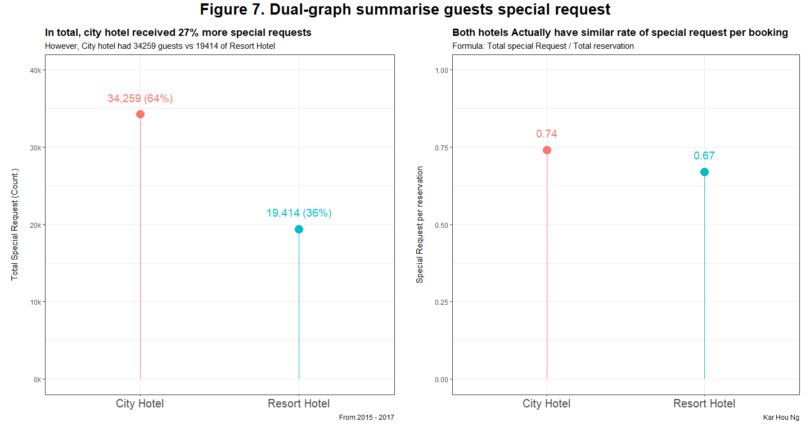
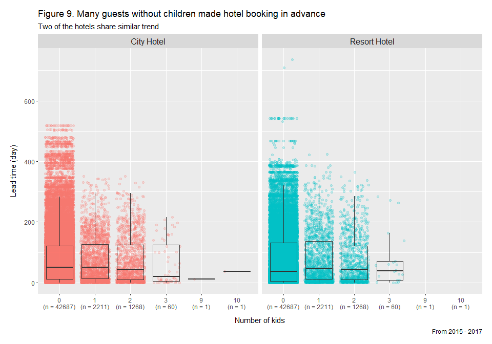

Exploring hotel data set to answer business questions
================
Kar Ng
2021

-   [1 SUMMARY](#1-summary)
-   [2 R PACKAGES](#2-r-packages)
-   [3 SCENARIO AND BUSINESS
    QUESTIONS](#3-scenario-and-business-questions)
-   [4 DATA PREPARATION](#4-data-preparation)
    -   [4.1 Data import](#41-data-import)
    -   [4.2 Data description](#42-data-description)
    -   [4.3 Data exploration](#43-data-exploration)
-   [5 DATA INTEGRITY ASSESSMENT](#5-data-integrity-assessment)
-   [6 DATA CLEANING](#6-data-cleaning)
-   [7 DATA MANIPULATION](#7-data-manipulation)
    -   [7.1 Manipulating factor
        variables](#71-manipulating-factor-variables)
    -   [7.2 Manipulate date](#72-manipulate-date)
    -   [7.3 Manipulating numerical
        variables](#73-manipulating-numerical-variables)
-   [8 EXPLORATORY DATA ANALYSIS
    (EDA)](#8-exploratory-data-analysis-eda)
    -   [8.1 City hotel has more
        reservations](#81-city-hotel-has-more-reservations)
    -   [8.2 City hotel has more VALID
        reservations](#82-city-hotel-has-more-valid-reservations)
    -   [8.3 Total revenue comparison](#83-total-revenue-comparison)
    -   [8.4 Countries where guests are
        from](#84-countries-where-guests-are-from)
    -   [8.5 Meals ordered by guests](#85-meals-ordered-by-guests)
    -   [8.6 Comparing visitors with children in both
        hotels](#86-comparing-visitors-with-children-in-both-hotels)
    -   [8.7 Which hotel has more special request per
        reservation?](#87-which-hotel-has-more-special-request-per-reservation)
    -   [8.8 Resort hotel need more parking
        spaces](#88-resort-hotel-need-more-parking-spaces)
    -   [8.9 Family with more children tend to book earlier? (Lead
        time)](#89-family-with-more-children-tend-to-book-earlier-lead-time)
    -   [8.10 Transient and Transient-party support the business of both
        hotels](#810-transient-and-transient-party-support-the-business-of-both-hotels)
    -   [8.11 Rarely repeated guest for both
        hotels](#811-rarely-repeated-guest-for-both-hotels)
    -   [8.12 Marketing - Market
        segment](#812-marketing---market-segment)
    -   [8.13 Marketing - distribution
        channel](#813-marketing---distribution-channel)
    -   [8.14 Almost all guests did not made a deposit to secure their
        bookings](#814-almost-all-guests-did-not-made-a-deposit-to-secure-their-bookings)
-   [9 CONCLUSION](#9-conclusion)
-   [10 LEGALITY](#10-legality)

------------------------------------------------------------------------


------------------------------------------------------------------------

Reading time: 27 minutes

## 1 SUMMARY

This is a personal project uses a data set introduced in the 6-month
extensive Google Data Analytics Professional Certificate program. This
data set recorded 119k rows of booking data and 32 columns of variables
for two hotels - a city and a resort, between 2015 to 2017. This project
aims to investigate the differences between these 2 type of hotels based
on data and information available in the data set.

This data set was fairly cleaned. Data manipulation was performed with a
bit of cleaning to synthesise several functional metrics and to convert
some data types into a new type. All analyses in this project was
completed in R Studio using R programming language and R Markdown.

14 graphs was synthesised to compare both hotels in 14 aspects. Results
only showed that city hotel had 20% to 30% more bookings than resort
hotel, however resort hotel has potential to generate more revenue with
lesser bookings, indicated in 2015 data which had less bookings but
higher revenue than city hotel. Majority of guests (77%) in both hotels
ordered only 1 meal. Generally guests in resort hotel will order at
least 1 meal, which had only 3% of guests ordered no meal compared to
14% of guests in city hotel that ordered no meal. Guests in resort hotel
had 4.5 times more demands in parking-space. Majority of guests booked
their reservations through travel agents and travel operator (82% in
city hotel vs 68% in resort hotel), but 10% more guests in resort hotel
booked directly to the hotel (12% in city hotel vs 22.6% in resort
hotel). Both hotels shared a lot of similarities in many statistics
covered in this project.

**Some graphs in this project: **


## 2 R PACKAGES

R Packages loaded for this projects included tidyverse series (ggplot2,
dplyr, tidyr, readr, purrr, tibble, stringr and forcats), DT, skimr,
kableExtra, treemapify, lubridate, gridExtra, grid, and hexbin.

``` r
library(tidyverse)
library(DT)
library(skimr)
library(kableExtra)
library(treemapify)
library(lubridate)
library(gridExtra)
library(grid)
library(hexbin)
```

## 3 SCENARIO AND BUSINESS QUESTIONS

It will be interesting to compare two hotels as both hotels may have
been built for different purposes. City hotels would very likely is just
a place for simple lodging, but resort hotels would have been built near
coastal regions, rain forests, theme parks, or having in-house
entertainment facilities for relaxation purposes. We might have some
insightful results after exploring their differences in reservation,
administration, and marketing statistics, and study the disparities.

Many business questions this project will be answering, but not limited
to:

-   How are resort and city hotels different from each other?  
-   How are most customers booked their room reservation?
-   How is the proportion of guests with kids in both hotels?
-   How is the deposit statistics in both hotels?
-   Do family size visitors with children often book in advance?

Please aware that the context of this data set may only apply to these
two specific hotels and may not represent the entire city and resort
hotel segments. Country’s GDP, people power of purchase, income
statistics, average size of families of the region, religious, cultures
and beliefs may be different from the country where the data set belongs
to.

Nonetheless, I will proceed the analysis.

## 4 DATA PREPARATION

The data set used in this project is called “Hotel Booking Demand”. It
was introduced by the 6-month extensive Google Data Analytics
Certificate I have completed on 31 May 2021. This data set was used by
the course in a few parts of its data analysis activities.

It is a public data set on Kaggle, by Jesse Mostipak, credited from the
article **Hotel Booking Demand Datasets**, written by Nuno Antonio, Ana
Almeida, and Luis Nunes for Data in Brief, Volume 22, February 2019. In
short about Kaggle, Kaggle is a great website for data science
community. Click this
[link](https://www.kaggle.com/jessemostipak/hotel-booking-demand) to go
to the relevant Kaggle webpage.

This hotel data set was downloaded from Kaggle and stored in a
spreadsheet csv file.

### 4.1 Data import

This section imports the csv hotel data set into R. Click the right
**code** to see associated codes. Following table show the first 10k
rows of data in the data set. There are nearly 120k rows of data.

``` r
mydata <- read_csv("hotel_bookings.csv")

mydata
```

    ## # A tibble: 119,390 x 32
    ##    hotel        is_canceled lead_time arrival_date_year arrival_date_month
    ##    <chr>              <dbl>     <dbl>             <dbl> <chr>             
    ##  1 Resort Hotel           0       342              2015 July              
    ##  2 Resort Hotel           0       737              2015 July              
    ##  3 Resort Hotel           0         7              2015 July              
    ##  4 Resort Hotel           0        13              2015 July              
    ##  5 Resort Hotel           0        14              2015 July              
    ##  6 Resort Hotel           0        14              2015 July              
    ##  7 Resort Hotel           0         0              2015 July              
    ##  8 Resort Hotel           0         9              2015 July              
    ##  9 Resort Hotel           1        85              2015 July              
    ## 10 Resort Hotel           1        75              2015 July              
    ## # ... with 119,380 more rows, and 27 more variables:
    ## #   arrival_date_week_number <dbl>, arrival_date_day_of_month <dbl>,
    ## #   stays_in_weekend_nights <dbl>, stays_in_week_nights <dbl>, adults <dbl>,
    ## #   children <dbl>, babies <dbl>, meal <chr>, country <chr>,
    ## #   market_segment <chr>, distribution_channel <chr>, is_repeated_guest <dbl>,
    ## #   previous_cancellations <dbl>, previous_bookings_not_canceled <dbl>,
    ## #   reserved_room_type <chr>, assigned_room_type <chr>, ...

### 4.2 Data description

Following table description is created by information extracted from the
above relevant Kaggle webpage. This table define and describe what are
the variables (or known as “factors” located at the first row grouping
each columns of data) in the data set.

``` r
Variables <- c("hotel", 
               "is_canceled",
               "lead_time",
               "arrival_date_year",
               "arrival_date_month",
               "arrival_date_week_number",
               "arrival_date_day_of_month",
               "stays_in_weekend_nights",
               "stays_in_week_nights",
               "adults",
               "children",
               "babies",
               "meal",
               "country",
               "market_segment",
               "distribution_channel",
               "is_repeated_guest",
               "previous_cancellations",
               "previous_bookings_not_canceled",
               "reserved_room_type",
               "assigned_room_type",
               "booking_changes",
               "deposit_type",
               "agent",
               "company",
               "days_in_waiting_list",
               "customer_type",
               "adr",
               "required_car_parking_spaces",
               "total_of_special_requests",
               "reservation_status",
               "reservation_status_date"
)

Description <- c("Two type of hotels are in this dataset, (1) Resort Hotel and (2) City Hotel.",
                 "Value indicating of the booking was canceled (1) or not (0).",
                 "Number of days that elapsed between the entering data of the booking into the PMS and the arrival date, or how long the booking was in advance.",
                 "Year of arrival date.",
                 "Month of arrival date.",
                 "Week number of year for arrival date.",
                 "Day of arrival date.",
                 "Number of weekend nights (Saturday or Sunday) the guest stayed or booked to stay at the hotel.",
                 "Number of week nights (Monday to Friday) the guest stayed or booked to stay at the hotel.",
                 "Number of adults.",
                 "Number of children.",
                 "Number of babies.",
                 "Type of meal booked. Categories are presented in standard hospitality meal packages: Undefined/SC – no meal package; BB – Bed & Breakfast; HB – Half board (breakfast and one other meal – usually dinner); FB – Full board (breakfast, lunch and dinner).",
                 "Country of origin. Categories are represented in the ISO 3155–3:2013 format.",
                 "Market segment designation. In categories, the term <TA> means Travel Agents and <TO> means Tour Operators.",
                 "Booking distribution channel. The term “TA” means “Travel Agents” and “TO” means “Tour Operators.", 
                 "Value indicating if the booking name was from a repeated guest (1) or not (0).",
                 "Number of previous bookings that were cancelled by the customer prior to the current booking.",
                 "Number of previous bookings not cancelled by the customer prior to the current booking.",
                 "Code of room type reserved. Code is presented instead of designation for anonymity reasons.",
                 "Code for the type of room assigned to the booking. Sometimes the assigned room type differs from the reserved room type due to hotel operation reasons (e.g. overbooking) or by customer request. Code is presented instead of designation for anonymity reasons.",
                 "Number of changes/amendments made to the booking from the moment the booking was entered on the PMS until the moment of check-in or cancellation.", 
                 "Indication on if the customer made a deposit to guarantee the booking. This variable can assume three categories: No Deposit – no deposit was made; Non Refund – a deposit was made in the value of the total stay cost; Refundable – a deposit was made with a value under the total cost of stay.",
                 "ID of the travel agency that made the booking.",
                 "ID of the company/entity that made the booking or responsible for paying the booking. ID is presented instead of designation for anonymity reasons.",
                 "Number of days the booking was in the waiting list before it was confirmed to the customer.",
                 "Type of booking, assuming one of four categories: (1) Contract - when the booking has an allotment or other type of contract associated to it; (2) Group – when the booking is associated to a group; (3) Transient – when the booking is not part of a group or contract, and is not associated to other transient booking; (4) Transient-party – when the booking is transient, but is associated to at least other transient booking.",
                 "Average Daily Rate as defined by dividing the sum of all lodging transactions by the total number of staying nights.",
                 "Number of car parking spaces required by the customer.",
                 "Number of special requests made by the customer (e.g. twin bed or high floor).",
                 "Reservation last status, assuming one of three categories: Canceled – booking was canceled by the customer; Check-Out – customer has checked in but already departed; No-Show – customer did not check-in and did inform the hotel of the reason why.",
                 "Date at which the last status was set. This variable can be used in conjunction with the ReservationStatus to understand when was the booking canceled or when did the customer checked-out of the hotel.")
                 
data.frame(Variables, Description) %>% 
  kbl() %>% 
  kable_styling(bootstrap_options = c("hover",
                                      "striped",
                                      "bordered")) %>% 
  scroll_box(height = "1000px")
```

<div
style="border: 1px solid #ddd; padding: 0px; overflow-y: scroll; height:1000px; ">

<table class="table table-hover table-striped table-bordered" style="margin-left: auto; margin-right: auto;">
<thead>
<tr>
<th style="text-align:left;position: sticky; top:0; background-color: #FFFFFF;">
Variables
</th>
<th style="text-align:left;position: sticky; top:0; background-color: #FFFFFF;">
Description
</th>
</tr>
</thead>
<tbody>
<tr>
<td style="text-align:left;">
hotel
</td>
<td style="text-align:left;">
Two type of hotels are in this dataset, (1) Resort Hotel and (2) City
Hotel.
</td>
</tr>
<tr>
<td style="text-align:left;">
is\_canceled
</td>
<td style="text-align:left;">
Value indicating of the booking was canceled (1) or not (0).
</td>
</tr>
<tr>
<td style="text-align:left;">
lead\_time
</td>
<td style="text-align:left;">
Number of days that elapsed between the entering data of the booking
into the PMS and the arrival date, or how long the booking was in
advance.
</td>
</tr>
<tr>
<td style="text-align:left;">
arrival\_date\_year
</td>
<td style="text-align:left;">
Year of arrival date.
</td>
</tr>
<tr>
<td style="text-align:left;">
arrival\_date\_month
</td>
<td style="text-align:left;">
Month of arrival date.
</td>
</tr>
<tr>
<td style="text-align:left;">
arrival\_date\_week\_number
</td>
<td style="text-align:left;">
Week number of year for arrival date.
</td>
</tr>
<tr>
<td style="text-align:left;">
arrival\_date\_day\_of\_month
</td>
<td style="text-align:left;">
Day of arrival date.
</td>
</tr>
<tr>
<td style="text-align:left;">
stays\_in\_weekend\_nights
</td>
<td style="text-align:left;">
Number of weekend nights (Saturday or Sunday) the guest stayed or booked
to stay at the hotel.
</td>
</tr>
<tr>
<td style="text-align:left;">
stays\_in\_week\_nights
</td>
<td style="text-align:left;">
Number of week nights (Monday to Friday) the guest stayed or booked to
stay at the hotel.
</td>
</tr>
<tr>
<td style="text-align:left;">
adults
</td>
<td style="text-align:left;">
Number of adults.
</td>
</tr>
<tr>
<td style="text-align:left;">
children
</td>
<td style="text-align:left;">
Number of children.
</td>
</tr>
<tr>
<td style="text-align:left;">
babies
</td>
<td style="text-align:left;">
Number of babies.
</td>
</tr>
<tr>
<td style="text-align:left;">
meal
</td>
<td style="text-align:left;">
Type of meal booked. Categories are presented in standard hospitality
meal packages: Undefined/SC – no meal package; BB – Bed & Breakfast; HB
– Half board (breakfast and one other meal – usually dinner); FB – Full
board (breakfast, lunch and dinner).
</td>
</tr>
<tr>
<td style="text-align:left;">
country
</td>
<td style="text-align:left;">
Country of origin. Categories are represented in the ISO 3155–3:2013
format.
</td>
</tr>
<tr>
<td style="text-align:left;">
market\_segment
</td>
<td style="text-align:left;">
Market segment designation. In categories, the term &lt;TA&gt; means
Travel Agents and &lt;TO&gt; means Tour Operators.
</td>
</tr>
<tr>
<td style="text-align:left;">
distribution\_channel
</td>
<td style="text-align:left;">
Booking distribution channel. The term “TA” means “Travel Agents” and
“TO” means “Tour Operators.
</td>
</tr>
<tr>
<td style="text-align:left;">
is\_repeated\_guest
</td>
<td style="text-align:left;">
Value indicating if the booking name was from a repeated guest (1) or
not (0).
</td>
</tr>
<tr>
<td style="text-align:left;">
previous\_cancellations
</td>
<td style="text-align:left;">
Number of previous bookings that were cancelled by the customer prior to
the current booking.
</td>
</tr>
<tr>
<td style="text-align:left;">
previous\_bookings\_not\_canceled
</td>
<td style="text-align:left;">
Number of previous bookings not cancelled by the customer prior to the
current booking.
</td>
</tr>
<tr>
<td style="text-align:left;">
reserved\_room\_type
</td>
<td style="text-align:left;">
Code of room type reserved. Code is presented instead of designation for
anonymity reasons.
</td>
</tr>
<tr>
<td style="text-align:left;">
assigned\_room\_type
</td>
<td style="text-align:left;">
Code for the type of room assigned to the booking. Sometimes the
assigned room type differs from the reserved room type due to hotel
operation reasons (e.g. overbooking) or by customer request. Code is
presented instead of designation for anonymity reasons.
</td>
</tr>
<tr>
<td style="text-align:left;">
booking\_changes
</td>
<td style="text-align:left;">
Number of changes/amendments made to the booking from the moment the
booking was entered on the PMS until the moment of check-in or
cancellation.
</td>
</tr>
<tr>
<td style="text-align:left;">
deposit\_type
</td>
<td style="text-align:left;">
Indication on if the customer made a deposit to guarantee the booking.
This variable can assume three categories: No Deposit – no deposit was
made; Non Refund – a deposit was made in the value of the total stay
cost; Refundable – a deposit was made with a value under the total cost
of stay.
</td>
</tr>
<tr>
<td style="text-align:left;">
agent
</td>
<td style="text-align:left;">
ID of the travel agency that made the booking.
</td>
</tr>
<tr>
<td style="text-align:left;">
company
</td>
<td style="text-align:left;">
ID of the company/entity that made the booking or responsible for paying
the booking. ID is presented instead of designation for anonymity
reasons.
</td>
</tr>
<tr>
<td style="text-align:left;">
days\_in\_waiting\_list
</td>
<td style="text-align:left;">
Number of days the booking was in the waiting list before it was
confirmed to the customer.
</td>
</tr>
<tr>
<td style="text-align:left;">
customer\_type
</td>
<td style="text-align:left;">
Type of booking, assuming one of four categories: (1) Contract - when
the booking has an allotment or other type of contract associated to it;
(2) Group – when the booking is associated to a group; (3) Transient –
when the booking is not part of a group or contract, and is not
associated to other transient booking; (4) Transient-party – when the
booking is transient, but is associated to at least other transient
booking.
</td>
</tr>
<tr>
<td style="text-align:left;">
adr
</td>
<td style="text-align:left;">
Average Daily Rate as defined by dividing the sum of all lodging
transactions by the total number of staying nights.
</td>
</tr>
<tr>
<td style="text-align:left;">
required\_car\_parking\_spaces
</td>
<td style="text-align:left;">
Number of car parking spaces required by the customer.
</td>
</tr>
<tr>
<td style="text-align:left;">
total\_of\_special\_requests
</td>
<td style="text-align:left;">
Number of special requests made by the customer (e.g. twin bed or high
floor).
</td>
</tr>
<tr>
<td style="text-align:left;">
reservation\_status
</td>
<td style="text-align:left;">
Reservation last status, assuming one of three categories: Canceled –
booking was canceled by the customer; Check-Out – customer has checked
in but already departed; No-Show – customer did not check-in and did
inform the hotel of the reason why.
</td>
</tr>
<tr>
<td style="text-align:left;">
reservation\_status\_date
</td>
<td style="text-align:left;">
Date at which the last status was set. This variable can be used in
conjunction with the ReservationStatus to understand when was the
booking canceled or when did the customer checked-out of the hotel.
</td>
</tr>
</tbody>
</table>

</div>

### 4.3 Data exploration

This data set has 119,390 rows of data and 32 columns hosting 32
variables.

Following is a quick table summarizing the detail and structural
conditions of this data set. Have a quick snapshot at the different
group of table and their columns.

------------------------------------------------------------------------

``` r
skim_without_charts(mydata)
```

<table style="width: auto;" class="table table-condensed">
<caption>
Data summary
</caption>
<thead>
<tr>
<th style="text-align:left;">
</th>
<th style="text-align:left;">
</th>
</tr>
</thead>
<tbody>
<tr>
<td style="text-align:left;">
Name
</td>
<td style="text-align:left;">
mydata
</td>
</tr>
<tr>
<td style="text-align:left;">
Number of rows
</td>
<td style="text-align:left;">
119390
</td>
</tr>
<tr>
<td style="text-align:left;">
Number of columns
</td>
<td style="text-align:left;">
32
</td>
</tr>
<tr>
<td style="text-align:left;">
\_\_\_\_\_\_\_\_\_\_\_\_\_\_\_\_\_\_\_\_\_\_\_
</td>
<td style="text-align:left;">
</td>
</tr>
<tr>
<td style="text-align:left;">
Column type frequency:
</td>
<td style="text-align:left;">
</td>
</tr>
<tr>
<td style="text-align:left;">
character
</td>
<td style="text-align:left;">
13
</td>
</tr>
<tr>
<td style="text-align:left;">
Date
</td>
<td style="text-align:left;">
1
</td>
</tr>
<tr>
<td style="text-align:left;">
numeric
</td>
<td style="text-align:left;">
18
</td>
</tr>
<tr>
<td style="text-align:left;">
\_\_\_\_\_\_\_\_\_\_\_\_\_\_\_\_\_\_\_\_\_\_\_\_
</td>
<td style="text-align:left;">
</td>
</tr>
<tr>
<td style="text-align:left;">
Group variables
</td>
<td style="text-align:left;">
None
</td>
</tr>
</tbody>
</table>

**Variable type: character**

<table>
<thead>
<tr>
<th style="text-align:left;">
skim\_variable
</th>
<th style="text-align:right;">
n\_missing
</th>
<th style="text-align:right;">
complete\_rate
</th>
<th style="text-align:right;">
min
</th>
<th style="text-align:right;">
max
</th>
<th style="text-align:right;">
empty
</th>
<th style="text-align:right;">
n\_unique
</th>
<th style="text-align:right;">
whitespace
</th>
</tr>
</thead>
<tbody>
<tr>
<td style="text-align:left;">
hotel
</td>
<td style="text-align:right;">
0
</td>
<td style="text-align:right;">
1
</td>
<td style="text-align:right;">
10
</td>
<td style="text-align:right;">
12
</td>
<td style="text-align:right;">
0
</td>
<td style="text-align:right;">
2
</td>
<td style="text-align:right;">
0
</td>
</tr>
<tr>
<td style="text-align:left;">
arrival\_date\_month
</td>
<td style="text-align:right;">
0
</td>
<td style="text-align:right;">
1
</td>
<td style="text-align:right;">
3
</td>
<td style="text-align:right;">
9
</td>
<td style="text-align:right;">
0
</td>
<td style="text-align:right;">
12
</td>
<td style="text-align:right;">
0
</td>
</tr>
<tr>
<td style="text-align:left;">
meal
</td>
<td style="text-align:right;">
0
</td>
<td style="text-align:right;">
1
</td>
<td style="text-align:right;">
2
</td>
<td style="text-align:right;">
9
</td>
<td style="text-align:right;">
0
</td>
<td style="text-align:right;">
5
</td>
<td style="text-align:right;">
0
</td>
</tr>
<tr>
<td style="text-align:left;">
country
</td>
<td style="text-align:right;">
0
</td>
<td style="text-align:right;">
1
</td>
<td style="text-align:right;">
2
</td>
<td style="text-align:right;">
4
</td>
<td style="text-align:right;">
0
</td>
<td style="text-align:right;">
178
</td>
<td style="text-align:right;">
0
</td>
</tr>
<tr>
<td style="text-align:left;">
market\_segment
</td>
<td style="text-align:right;">
0
</td>
<td style="text-align:right;">
1
</td>
<td style="text-align:right;">
6
</td>
<td style="text-align:right;">
13
</td>
<td style="text-align:right;">
0
</td>
<td style="text-align:right;">
8
</td>
<td style="text-align:right;">
0
</td>
</tr>
<tr>
<td style="text-align:left;">
distribution\_channel
</td>
<td style="text-align:right;">
0
</td>
<td style="text-align:right;">
1
</td>
<td style="text-align:right;">
3
</td>
<td style="text-align:right;">
9
</td>
<td style="text-align:right;">
0
</td>
<td style="text-align:right;">
5
</td>
<td style="text-align:right;">
0
</td>
</tr>
<tr>
<td style="text-align:left;">
reserved\_room\_type
</td>
<td style="text-align:right;">
0
</td>
<td style="text-align:right;">
1
</td>
<td style="text-align:right;">
1
</td>
<td style="text-align:right;">
1
</td>
<td style="text-align:right;">
0
</td>
<td style="text-align:right;">
10
</td>
<td style="text-align:right;">
0
</td>
</tr>
<tr>
<td style="text-align:left;">
assigned\_room\_type
</td>
<td style="text-align:right;">
0
</td>
<td style="text-align:right;">
1
</td>
<td style="text-align:right;">
1
</td>
<td style="text-align:right;">
1
</td>
<td style="text-align:right;">
0
</td>
<td style="text-align:right;">
12
</td>
<td style="text-align:right;">
0
</td>
</tr>
<tr>
<td style="text-align:left;">
deposit\_type
</td>
<td style="text-align:right;">
0
</td>
<td style="text-align:right;">
1
</td>
<td style="text-align:right;">
10
</td>
<td style="text-align:right;">
10
</td>
<td style="text-align:right;">
0
</td>
<td style="text-align:right;">
3
</td>
<td style="text-align:right;">
0
</td>
</tr>
<tr>
<td style="text-align:left;">
agent
</td>
<td style="text-align:right;">
0
</td>
<td style="text-align:right;">
1
</td>
<td style="text-align:right;">
1
</td>
<td style="text-align:right;">
4
</td>
<td style="text-align:right;">
0
</td>
<td style="text-align:right;">
334
</td>
<td style="text-align:right;">
0
</td>
</tr>
<tr>
<td style="text-align:left;">
company
</td>
<td style="text-align:right;">
0
</td>
<td style="text-align:right;">
1
</td>
<td style="text-align:right;">
1
</td>
<td style="text-align:right;">
4
</td>
<td style="text-align:right;">
0
</td>
<td style="text-align:right;">
353
</td>
<td style="text-align:right;">
0
</td>
</tr>
<tr>
<td style="text-align:left;">
customer\_type
</td>
<td style="text-align:right;">
0
</td>
<td style="text-align:right;">
1
</td>
<td style="text-align:right;">
5
</td>
<td style="text-align:right;">
15
</td>
<td style="text-align:right;">
0
</td>
<td style="text-align:right;">
4
</td>
<td style="text-align:right;">
0
</td>
</tr>
<tr>
<td style="text-align:left;">
reservation\_status
</td>
<td style="text-align:right;">
0
</td>
<td style="text-align:right;">
1
</td>
<td style="text-align:right;">
7
</td>
<td style="text-align:right;">
9
</td>
<td style="text-align:right;">
0
</td>
<td style="text-align:right;">
3
</td>
<td style="text-align:right;">
0
</td>
</tr>
</tbody>
</table>

**Variable type: Date**

<table>
<thead>
<tr>
<th style="text-align:left;">
skim\_variable
</th>
<th style="text-align:right;">
n\_missing
</th>
<th style="text-align:right;">
complete\_rate
</th>
<th style="text-align:left;">
min
</th>
<th style="text-align:left;">
max
</th>
<th style="text-align:left;">
median
</th>
<th style="text-align:right;">
n\_unique
</th>
</tr>
</thead>
<tbody>
<tr>
<td style="text-align:left;">
reservation\_status\_date
</td>
<td style="text-align:right;">
0
</td>
<td style="text-align:right;">
1
</td>
<td style="text-align:left;">
2014-10-17
</td>
<td style="text-align:left;">
2017-09-14
</td>
<td style="text-align:left;">
2016-08-07
</td>
<td style="text-align:right;">
926
</td>
</tr>
</tbody>
</table>

**Variable type: numeric**

<table>
<thead>
<tr>
<th style="text-align:left;">
skim\_variable
</th>
<th style="text-align:right;">
n\_missing
</th>
<th style="text-align:right;">
complete\_rate
</th>
<th style="text-align:right;">
mean
</th>
<th style="text-align:right;">
sd
</th>
<th style="text-align:right;">
p0
</th>
<th style="text-align:right;">
p25
</th>
<th style="text-align:right;">
p50
</th>
<th style="text-align:right;">
p75
</th>
<th style="text-align:right;">
p100
</th>
</tr>
</thead>
<tbody>
<tr>
<td style="text-align:left;">
is\_canceled
</td>
<td style="text-align:right;">
0
</td>
<td style="text-align:right;">
1
</td>
<td style="text-align:right;">
0.37
</td>
<td style="text-align:right;">
0.48
</td>
<td style="text-align:right;">
0.00
</td>
<td style="text-align:right;">
0.00
</td>
<td style="text-align:right;">
0.00
</td>
<td style="text-align:right;">
1
</td>
<td style="text-align:right;">
1
</td>
</tr>
<tr>
<td style="text-align:left;">
lead\_time
</td>
<td style="text-align:right;">
0
</td>
<td style="text-align:right;">
1
</td>
<td style="text-align:right;">
104.01
</td>
<td style="text-align:right;">
106.86
</td>
<td style="text-align:right;">
0.00
</td>
<td style="text-align:right;">
18.00
</td>
<td style="text-align:right;">
69.00
</td>
<td style="text-align:right;">
160
</td>
<td style="text-align:right;">
737
</td>
</tr>
<tr>
<td style="text-align:left;">
arrival\_date\_year
</td>
<td style="text-align:right;">
0
</td>
<td style="text-align:right;">
1
</td>
<td style="text-align:right;">
2016.16
</td>
<td style="text-align:right;">
0.71
</td>
<td style="text-align:right;">
2015.00
</td>
<td style="text-align:right;">
2016.00
</td>
<td style="text-align:right;">
2016.00
</td>
<td style="text-align:right;">
2017
</td>
<td style="text-align:right;">
2017
</td>
</tr>
<tr>
<td style="text-align:left;">
arrival\_date\_week\_number
</td>
<td style="text-align:right;">
0
</td>
<td style="text-align:right;">
1
</td>
<td style="text-align:right;">
27.17
</td>
<td style="text-align:right;">
13.61
</td>
<td style="text-align:right;">
1.00
</td>
<td style="text-align:right;">
16.00
</td>
<td style="text-align:right;">
28.00
</td>
<td style="text-align:right;">
38
</td>
<td style="text-align:right;">
53
</td>
</tr>
<tr>
<td style="text-align:left;">
arrival\_date\_day\_of\_month
</td>
<td style="text-align:right;">
0
</td>
<td style="text-align:right;">
1
</td>
<td style="text-align:right;">
15.80
</td>
<td style="text-align:right;">
8.78
</td>
<td style="text-align:right;">
1.00
</td>
<td style="text-align:right;">
8.00
</td>
<td style="text-align:right;">
16.00
</td>
<td style="text-align:right;">
23
</td>
<td style="text-align:right;">
31
</td>
</tr>
<tr>
<td style="text-align:left;">
stays\_in\_weekend\_nights
</td>
<td style="text-align:right;">
0
</td>
<td style="text-align:right;">
1
</td>
<td style="text-align:right;">
0.93
</td>
<td style="text-align:right;">
1.00
</td>
<td style="text-align:right;">
0.00
</td>
<td style="text-align:right;">
0.00
</td>
<td style="text-align:right;">
1.00
</td>
<td style="text-align:right;">
2
</td>
<td style="text-align:right;">
19
</td>
</tr>
<tr>
<td style="text-align:left;">
stays\_in\_week\_nights
</td>
<td style="text-align:right;">
0
</td>
<td style="text-align:right;">
1
</td>
<td style="text-align:right;">
2.50
</td>
<td style="text-align:right;">
1.91
</td>
<td style="text-align:right;">
0.00
</td>
<td style="text-align:right;">
1.00
</td>
<td style="text-align:right;">
2.00
</td>
<td style="text-align:right;">
3
</td>
<td style="text-align:right;">
50
</td>
</tr>
<tr>
<td style="text-align:left;">
adults
</td>
<td style="text-align:right;">
0
</td>
<td style="text-align:right;">
1
</td>
<td style="text-align:right;">
1.86
</td>
<td style="text-align:right;">
0.58
</td>
<td style="text-align:right;">
0.00
</td>
<td style="text-align:right;">
2.00
</td>
<td style="text-align:right;">
2.00
</td>
<td style="text-align:right;">
2
</td>
<td style="text-align:right;">
55
</td>
</tr>
<tr>
<td style="text-align:left;">
children
</td>
<td style="text-align:right;">
4
</td>
<td style="text-align:right;">
1
</td>
<td style="text-align:right;">
0.10
</td>
<td style="text-align:right;">
0.40
</td>
<td style="text-align:right;">
0.00
</td>
<td style="text-align:right;">
0.00
</td>
<td style="text-align:right;">
0.00
</td>
<td style="text-align:right;">
0
</td>
<td style="text-align:right;">
10
</td>
</tr>
<tr>
<td style="text-align:left;">
babies
</td>
<td style="text-align:right;">
0
</td>
<td style="text-align:right;">
1
</td>
<td style="text-align:right;">
0.01
</td>
<td style="text-align:right;">
0.10
</td>
<td style="text-align:right;">
0.00
</td>
<td style="text-align:right;">
0.00
</td>
<td style="text-align:right;">
0.00
</td>
<td style="text-align:right;">
0
</td>
<td style="text-align:right;">
10
</td>
</tr>
<tr>
<td style="text-align:left;">
is\_repeated\_guest
</td>
<td style="text-align:right;">
0
</td>
<td style="text-align:right;">
1
</td>
<td style="text-align:right;">
0.03
</td>
<td style="text-align:right;">
0.18
</td>
<td style="text-align:right;">
0.00
</td>
<td style="text-align:right;">
0.00
</td>
<td style="text-align:right;">
0.00
</td>
<td style="text-align:right;">
0
</td>
<td style="text-align:right;">
1
</td>
</tr>
<tr>
<td style="text-align:left;">
previous\_cancellations
</td>
<td style="text-align:right;">
0
</td>
<td style="text-align:right;">
1
</td>
<td style="text-align:right;">
0.09
</td>
<td style="text-align:right;">
0.84
</td>
<td style="text-align:right;">
0.00
</td>
<td style="text-align:right;">
0.00
</td>
<td style="text-align:right;">
0.00
</td>
<td style="text-align:right;">
0
</td>
<td style="text-align:right;">
26
</td>
</tr>
<tr>
<td style="text-align:left;">
previous\_bookings\_not\_canceled
</td>
<td style="text-align:right;">
0
</td>
<td style="text-align:right;">
1
</td>
<td style="text-align:right;">
0.14
</td>
<td style="text-align:right;">
1.50
</td>
<td style="text-align:right;">
0.00
</td>
<td style="text-align:right;">
0.00
</td>
<td style="text-align:right;">
0.00
</td>
<td style="text-align:right;">
0
</td>
<td style="text-align:right;">
72
</td>
</tr>
<tr>
<td style="text-align:left;">
booking\_changes
</td>
<td style="text-align:right;">
0
</td>
<td style="text-align:right;">
1
</td>
<td style="text-align:right;">
0.22
</td>
<td style="text-align:right;">
0.65
</td>
<td style="text-align:right;">
0.00
</td>
<td style="text-align:right;">
0.00
</td>
<td style="text-align:right;">
0.00
</td>
<td style="text-align:right;">
0
</td>
<td style="text-align:right;">
21
</td>
</tr>
<tr>
<td style="text-align:left;">
days\_in\_waiting\_list
</td>
<td style="text-align:right;">
0
</td>
<td style="text-align:right;">
1
</td>
<td style="text-align:right;">
2.32
</td>
<td style="text-align:right;">
17.59
</td>
<td style="text-align:right;">
0.00
</td>
<td style="text-align:right;">
0.00
</td>
<td style="text-align:right;">
0.00
</td>
<td style="text-align:right;">
0
</td>
<td style="text-align:right;">
391
</td>
</tr>
<tr>
<td style="text-align:left;">
adr
</td>
<td style="text-align:right;">
0
</td>
<td style="text-align:right;">
1
</td>
<td style="text-align:right;">
101.83
</td>
<td style="text-align:right;">
50.54
</td>
<td style="text-align:right;">
-6.38
</td>
<td style="text-align:right;">
69.29
</td>
<td style="text-align:right;">
94.58
</td>
<td style="text-align:right;">
126
</td>
<td style="text-align:right;">
5400
</td>
</tr>
<tr>
<td style="text-align:left;">
required\_car\_parking\_spaces
</td>
<td style="text-align:right;">
0
</td>
<td style="text-align:right;">
1
</td>
<td style="text-align:right;">
0.06
</td>
<td style="text-align:right;">
0.25
</td>
<td style="text-align:right;">
0.00
</td>
<td style="text-align:right;">
0.00
</td>
<td style="text-align:right;">
0.00
</td>
<td style="text-align:right;">
0
</td>
<td style="text-align:right;">
8
</td>
</tr>
<tr>
<td style="text-align:left;">
total\_of\_special\_requests
</td>
<td style="text-align:right;">
0
</td>
<td style="text-align:right;">
1
</td>
<td style="text-align:right;">
0.57
</td>
<td style="text-align:right;">
0.79
</td>
<td style="text-align:right;">
0.00
</td>
<td style="text-align:right;">
0.00
</td>
<td style="text-align:right;">
0.00
</td>
<td style="text-align:right;">
1
</td>
<td style="text-align:right;">
5
</td>
</tr>
</tbody>
</table>

------------------------------------------------------------------------

This data set is surprisingly *clean* by looking at the **n\_missing**
and **complete\_rate**, they are associated with the number of missing
values detected in each variable in the data set. Other than the
variable, **Children** that has a near perfect **complete rate**, the
rest of all variables do not have missing value.

Looking at the variable type “character”,

-   This data set has **13 character** variables such as hotel, meal,
    country, market\_segment, deposit\_tyoem agent, customer type and
    etc.
-   Looking at the **n\_unique**, all of this character variables can be
    used as grouping objects to group our data during analysis. They
    have unique levels of attributes. For example, such as variable
    “hotel”, it has 2 n\_unique levels for 119,390 rows of hotel data.
    it indicating that these data can be classified into 2 groups during
    analysis. And it may applies to the rest of the variables falling
    into this group. These variables will be converted into **factor**
    during data manipulation for this grouping characteristic to
    happen.  
-   The column **whitesoace** shows there are no white spaces in the
    data set to clean.

Looking at the variable type “Date”,

-   Date is usually a labelled as “character” when they are first
    imported into R because many countries and companies usually do not
    have their arrangement of year, month, day matching the standard
    date format of R (year-month-day.)  
-   However, this data set has its date that matching the format of R
    and has been recognised and classified by the R to *date* type.
-   Correct classification of data type is important for any analysis
    occurring in later stages of a data analysis project.  
-   There is no missing n value in date.  
-   We can clearly see that data in this data set were collected between
    2014-10-17 to 2017-09-14. It gives us an idea of how old this data
    is and its range.

Looking at the variable type “numeric”,

-   There are 18 numerical variable in this data set, such as not
    limited to lead time, dates of arrival into numeric year, month,
    day, the numbers of adult, children and babies, as well as average
    daily rate (adr), number of car parking spaces required by visitors
    and etc.

Another way of quick looking at all current variables:

``` r
names(mydata)
```

    ##  [1] "hotel"                          "is_canceled"                   
    ##  [3] "lead_time"                      "arrival_date_year"             
    ##  [5] "arrival_date_month"             "arrival_date_week_number"      
    ##  [7] "arrival_date_day_of_month"      "stays_in_weekend_nights"       
    ##  [9] "stays_in_week_nights"           "adults"                        
    ## [11] "children"                       "babies"                        
    ## [13] "meal"                           "country"                       
    ## [15] "market_segment"                 "distribution_channel"          
    ## [17] "is_repeated_guest"              "previous_cancellations"        
    ## [19] "previous_bookings_not_canceled" "reserved_room_type"            
    ## [21] "assigned_room_type"             "booking_changes"               
    ## [23] "deposit_type"                   "agent"                         
    ## [25] "company"                        "days_in_waiting_list"          
    ## [27] "customer_type"                  "adr"                           
    ## [29] "required_car_parking_spaces"    "total_of_special_requests"     
    ## [31] "reservation_status"             "reservation_status_date"

## 5 DATA INTEGRITY ASSESSMENT

The information provided in this data set are relevant to the business
questions in section 3 **SCENARIO AND BUSINESS QUESTIONS** and is able
to answer those questions.

This is a secondary data because I am using a second source of data to
answer my own questions about the hotel sector instead of collecting the
data myself. So, the data set in this context is not considered original
data set. Although it is a secondary data source but I grade it a great
and credited data source as the data set was introduced and identified
as a useful data set for students by Google for its well-designed,
extensive data analytics course. This data set was also from a research
article, studied by relevant professional, having their credits on
*Kaggle* by the uploader.

The data set is also highly comprehensive and provides multiple aspects
of variables to answer my questions. This data set is also cited in
*Kaggle* to identify where the data set is from and the name and authors
of the relevant research paper. This data is also considered current,
collected within last 5 to 10 years, and it would represent current
context and conditions, but may be not after the COVID19 outbreak in
2020.

Thus, this data set is relevant, secondary, comprehensive, cited and is
considered moderately current. And these attributes apply to the results
of this project.

## 6 DATA CLEANING

From the table in section 4.3 Data exploration, we have seen that the
data set may has been cleaned before uploading to *kaggle* as a public
data set for public-use. In the data set, there is no missing values,
and no white spaces in character variables to trim.

However, there are a lot of **character** data that can be used for
grouping, known as categorical features. Let’s convert them into
**factor** so that we are able to view what the attributes (known as
levels) within them.

## 7 DATA MANIPULATION

### 7.1 Manipulating factor variables

Converting **character** variables into **factor** variables using
following code (click the *code* on the right).

``` r
# The original dataset is called "mydata", we always do not touch the original data set by creating a new object and work on it because we may need the orignal dataset in later analysis, or maybe not. This step is to save time and protect the original dataset. 

mydata2 <- mydata

# From now on, I will manipulate, clean and using this mydata2 for all analysis. 

mydata2 <- mydata2 %>% 
  mutate_if(is.character, factor)
```

Lets check is there any **character** denoted as **chr** type in the
mydata2?

``` r
mydata2 %>% 
  select_if(is.character) %>% 
  glimpse()
```

    ## Rows: 119,390
    ## Columns: 0

I get **zero column** of that, which mean there is none, and it also
means that the conversion of all character variables into factor has
been successful.

From following structural exploration of the data set, we are able to
see the number of **levels** in each variables. For example, hotel has 2
levels of which are City hotel and Resort Hotels; arrival\_date\_month
has 12 levels started with “April“,”Auguest" and so on and so forth.

``` r
mydata2 %>% 
  select_if(is.factor) %>% 
  str()
```

    ## tibble [119,390 x 13] (S3: tbl_df/tbl/data.frame)
    ##  $ hotel               : Factor w/ 2 levels "City Hotel","Resort Hotel": 2 2 2 2 2 2 2 2 2 2 ...
    ##  $ arrival_date_month  : Factor w/ 12 levels "April","August",..: 6 6 6 6 6 6 6 6 6 6 ...
    ##  $ meal                : Factor w/ 5 levels "BB","FB","HB",..: 1 1 1 1 1 1 1 2 1 3 ...
    ##  $ country             : Factor w/ 178 levels "ABW","AGO","AIA",..: 137 137 60 60 60 60 137 137 137 137 ...
    ##  $ market_segment      : Factor w/ 8 levels "Aviation","Complementary",..: 4 4 4 3 7 7 4 4 7 6 ...
    ##  $ distribution_channel: Factor w/ 5 levels "Corporate","Direct",..: 2 2 2 1 4 4 2 2 4 4 ...
    ##  $ reserved_room_type  : Factor w/ 10 levels "A","B","C","D",..: 3 3 1 1 1 1 3 3 1 4 ...
    ##  $ assigned_room_type  : Factor w/ 12 levels "A","B","C","D",..: 3 3 3 1 1 1 3 3 1 4 ...
    ##  $ deposit_type        : Factor w/ 3 levels "No Deposit","Non Refund",..: 1 1 1 1 1 1 1 1 1 1 ...
    ##  $ agent               : Factor w/ 334 levels "1","10","103",..: 334 334 334 157 103 103 334 156 103 40 ...
    ##  $ company             : Factor w/ 353 levels "10","100","101",..: 353 353 353 353 353 353 353 353 353 353 ...
    ##  $ customer_type       : Factor w/ 4 levels "Contract","Group",..: 3 3 3 3 3 3 3 3 3 3 ...
    ##  $ reservation_status  : Factor w/ 3 levels "Canceled","Check-Out",..: 2 2 2 2 2 2 2 2 1 1 ...

We can tell that arrival\_date\_month is comprised of months and we need
to sort it from January to December.

How about other variables? Do they need any cleaning such as spaces
within the string, typo, or NA (non-filling field that needs attention)?

Below is a complete summary of all levels within each of the 13 factor
variables.

------------------------------------------------------------------------

``` r
mydata2 %>% 
  select_if(is.factor) %>% 
  sapply(levels)
```

    ## $hotel
    ## [1] "City Hotel"   "Resort Hotel"
    ## 
    ## $arrival_date_month
    ##  [1] "April"     "August"    "December"  "February"  "January"   "July"     
    ##  [7] "June"      "March"     "May"       "November"  "October"   "September"
    ## 
    ## $meal
    ## [1] "BB"        "FB"        "HB"        "SC"        "Undefined"
    ## 
    ## $country
    ##   [1] "ABW"  "AGO"  "AIA"  "ALB"  "AND"  "ARE"  "ARG"  "ARM"  "ASM"  "ATA" 
    ##  [11] "ATF"  "AUS"  "AUT"  "AZE"  "BDI"  "BEL"  "BEN"  "BFA"  "BGD"  "BGR" 
    ##  [21] "BHR"  "BHS"  "BIH"  "BLR"  "BOL"  "BRA"  "BRB"  "BWA"  "CAF"  "CHE" 
    ##  [31] "CHL"  "CHN"  "CIV"  "CMR"  "CN"   "COL"  "COM"  "CPV"  "CRI"  "CUB" 
    ##  [41] "CYM"  "CYP"  "CZE"  "DEU"  "DJI"  "DMA"  "DNK"  "DOM"  "DZA"  "ECU" 
    ##  [51] "EGY"  "ESP"  "EST"  "ETH"  "FIN"  "FJI"  "FRA"  "FRO"  "GAB"  "GBR" 
    ##  [61] "GEO"  "GGY"  "GHA"  "GIB"  "GLP"  "GNB"  "GRC"  "GTM"  "GUY"  "HKG" 
    ##  [71] "HND"  "HRV"  "HUN"  "IDN"  "IMN"  "IND"  "IRL"  "IRN"  "IRQ"  "ISL" 
    ##  [81] "ISR"  "ITA"  "JAM"  "JEY"  "JOR"  "JPN"  "KAZ"  "KEN"  "KHM"  "KIR" 
    ##  [91] "KNA"  "KOR"  "KWT"  "LAO"  "LBN"  "LBY"  "LCA"  "LIE"  "LKA"  "LTU" 
    ## [101] "LUX"  "LVA"  "MAC"  "MAR"  "MCO"  "MDG"  "MDV"  "MEX"  "MKD"  "MLI" 
    ## [111] "MLT"  "MMR"  "MNE"  "MOZ"  "MRT"  "MUS"  "MWI"  "MYS"  "MYT"  "NAM" 
    ## [121] "NCL"  "NGA"  "NIC"  "NLD"  "NOR"  "NPL"  "NULL" "NZL"  "OMN"  "PAK" 
    ## [131] "PAN"  "PER"  "PHL"  "PLW"  "POL"  "PRI"  "PRT"  "PRY"  "PYF"  "QAT" 
    ## [141] "ROU"  "RUS"  "RWA"  "SAU"  "SDN"  "SEN"  "SGP"  "SLE"  "SLV"  "SMR" 
    ## [151] "SRB"  "STP"  "SUR"  "SVK"  "SVN"  "SWE"  "SYC"  "SYR"  "TGO"  "THA" 
    ## [161] "TJK"  "TMP"  "TUN"  "TUR"  "TWN"  "TZA"  "UGA"  "UKR"  "UMI"  "URY" 
    ## [171] "USA"  "UZB"  "VEN"  "VGB"  "VNM"  "ZAF"  "ZMB"  "ZWE" 
    ## 
    ## $market_segment
    ## [1] "Aviation"      "Complementary" "Corporate"     "Direct"       
    ## [5] "Groups"        "Offline TA/TO" "Online TA"     "Undefined"    
    ## 
    ## $distribution_channel
    ## [1] "Corporate" "Direct"    "GDS"       "TA/TO"     "Undefined"
    ## 
    ## $reserved_room_type
    ##  [1] "A" "B" "C" "D" "E" "F" "G" "H" "L" "P"
    ## 
    ## $assigned_room_type
    ##  [1] "A" "B" "C" "D" "E" "F" "G" "H" "I" "K" "L" "P"
    ## 
    ## $deposit_type
    ## [1] "No Deposit" "Non Refund" "Refundable"
    ## 
    ## $agent
    ##   [1] "1"    "10"   "103"  "104"  "105"  "106"  "107"  "11"   "110"  "111" 
    ##  [11] "112"  "114"  "115"  "117"  "118"  "119"  "12"   "121"  "122"  "126" 
    ##  [21] "127"  "128"  "129"  "13"   "132"  "133"  "134"  "135"  "138"  "139" 
    ##  [31] "14"   "141"  "142"  "143"  "144"  "146"  "147"  "148"  "149"  "15"  
    ##  [41] "150"  "151"  "152"  "153"  "154"  "155"  "156"  "157"  "158"  "159" 
    ##  [51] "16"   "162"  "163"  "165"  "167"  "168"  "17"   "170"  "171"  "173" 
    ##  [61] "174"  "175"  "177"  "179"  "180"  "181"  "182"  "183"  "184"  "185" 
    ##  [71] "187"  "19"   "191"  "192"  "193"  "195"  "196"  "197"  "2"    "20"  
    ##  [81] "201"  "205"  "208"  "21"   "210"  "211"  "213"  "214"  "215"  "216" 
    ##  [91] "219"  "22"   "220"  "223"  "227"  "229"  "23"   "232"  "234"  "235" 
    ## [101] "236"  "24"   "240"  "241"  "242"  "243"  "244"  "245"  "247"  "248" 
    ## [111] "249"  "25"   "250"  "251"  "252"  "253"  "254"  "256"  "257"  "258" 
    ## [121] "26"   "261"  "262"  "265"  "267"  "269"  "27"   "270"  "273"  "275" 
    ## [131] "276"  "278"  "28"   "280"  "281"  "282"  "283"  "285"  "286"  "287" 
    ## [141] "288"  "289"  "29"   "290"  "291"  "294"  "295"  "296"  "298"  "299" 
    ## [151] "3"    "30"   "300"  "301"  "302"  "303"  "304"  "305"  "306"  "307" 
    ## [161] "308"  "31"   "310"  "313"  "314"  "315"  "32"   "321"  "323"  "324" 
    ## [171] "325"  "326"  "327"  "328"  "33"   "330"  "331"  "332"  "333"  "334" 
    ## [181] "335"  "336"  "337"  "339"  "34"   "341"  "344"  "346"  "348"  "35"  
    ## [191] "350"  "352"  "354"  "355"  "358"  "359"  "36"   "360"  "363"  "364" 
    ## [201] "367"  "368"  "37"   "370"  "371"  "375"  "378"  "38"   "384"  "385" 
    ## [211] "387"  "388"  "39"   "390"  "391"  "393"  "394"  "397"  "4"    "40"  
    ## [221] "403"  "404"  "405"  "406"  "408"  "41"   "410"  "411"  "414"  "416" 
    ## [231] "418"  "42"   "420"  "423"  "425"  "426"  "427"  "429"  "430"  "431" 
    ## [241] "432"  "433"  "434"  "436"  "438"  "44"   "440"  "441"  "444"  "446" 
    ## [251] "449"  "45"   "450"  "451"  "453"  "454"  "455"  "459"  "461"  "464" 
    ## [261] "467"  "468"  "469"  "47"   "472"  "474"  "475"  "476"  "479"  "480" 
    ## [271] "481"  "483"  "484"  "492"  "493"  "495"  "497"  "5"    "50"   "502" 
    ## [281] "508"  "509"  "510"  "52"   "526"  "527"  "53"   "531"  "535"  "54"  
    ## [291] "55"   "56"   "57"   "58"   "59"   "6"    "60"   "61"   "63"   "64"  
    ## [301] "66"   "67"   "68"   "69"   "7"    "70"   "71"   "72"   "73"   "74"  
    ## [311] "75"   "77"   "78"   "79"   "8"    "81"   "82"   "83"   "85"   "86"  
    ## [321] "87"   "88"   "89"   "9"    "90"   "91"   "92"   "93"   "94"   "95"  
    ## [331] "96"   "98"   "99"   "NULL"
    ## 
    ## $company
    ##   [1] "10"   "100"  "101"  "102"  "103"  "104"  "105"  "106"  "107"  "108" 
    ##  [11] "109"  "11"   "110"  "112"  "113"  "115"  "116"  "118"  "12"   "120" 
    ##  [21] "122"  "126"  "127"  "130"  "132"  "135"  "137"  "139"  "14"   "140" 
    ##  [31] "142"  "143"  "144"  "146"  "148"  "149"  "150"  "153"  "154"  "158" 
    ##  [41] "159"  "16"   "160"  "163"  "165"  "167"  "168"  "169"  "174"  "178" 
    ##  [51] "179"  "18"   "180"  "183"  "184"  "185"  "186"  "192"  "193"  "195" 
    ##  [61] "197"  "20"   "200"  "202"  "203"  "204"  "207"  "209"  "210"  "212" 
    ##  [71] "213"  "215"  "216"  "217"  "218"  "219"  "22"   "220"  "221"  "222" 
    ##  [81] "223"  "224"  "225"  "227"  "229"  "230"  "232"  "233"  "234"  "237" 
    ##  [91] "238"  "240"  "242"  "243"  "245"  "246"  "250"  "251"  "253"  "254" 
    ## [101] "255"  "257"  "258"  "259"  "260"  "263"  "264"  "268"  "269"  "270" 
    ## [111] "271"  "272"  "273"  "274"  "275"  "277"  "278"  "279"  "28"   "280" 
    ## [121] "281"  "282"  "284"  "286"  "287"  "288"  "289"  "29"   "290"  "291" 
    ## [131] "292"  "293"  "297"  "301"  "302"  "304"  "305"  "307"  "308"  "309" 
    ## [141] "31"   "311"  "312"  "313"  "314"  "316"  "317"  "318"  "319"  "32"  
    ## [151] "320"  "321"  "323"  "324"  "325"  "329"  "330"  "331"  "332"  "333" 
    ## [161] "334"  "337"  "338"  "34"   "341"  "342"  "343"  "346"  "347"  "348" 
    ## [171] "349"  "35"   "350"  "351"  "352"  "353"  "355"  "356"  "357"  "358" 
    ## [181] "360"  "361"  "362"  "364"  "365"  "366"  "367"  "368"  "369"  "37"  
    ## [191] "370"  "371"  "372"  "373"  "376"  "377"  "378"  "379"  "38"   "380" 
    ## [201] "382"  "383"  "384"  "385"  "386"  "388"  "39"   "390"  "391"  "392" 
    ## [211] "393"  "394"  "395"  "396"  "397"  "398"  "399"  "40"   "400"  "401" 
    ## [221] "402"  "403"  "405"  "407"  "408"  "409"  "410"  "411"  "412"  "413" 
    ## [231] "415"  "416"  "417"  "418"  "419"  "42"   "420"  "421"  "422"  "423" 
    ## [241] "424"  "425"  "426"  "428"  "429"  "43"   "433"  "435"  "436"  "437" 
    ## [251] "439"  "442"  "443"  "444"  "445"  "446"  "447"  "448"  "45"   "450" 
    ## [261] "451"  "452"  "454"  "455"  "456"  "457"  "458"  "459"  "46"   "460" 
    ## [271] "461"  "465"  "466"  "47"   "470"  "477"  "478"  "479"  "48"   "481" 
    ## [281] "482"  "483"  "484"  "485"  "486"  "487"  "489"  "49"   "490"  "491" 
    ## [291] "492"  "494"  "496"  "497"  "498"  "499"  "501"  "504"  "506"  "507" 
    ## [301] "51"   "511"  "512"  "513"  "514"  "515"  "516"  "518"  "52"   "520" 
    ## [311] "521"  "523"  "525"  "528"  "53"   "530"  "531"  "534"  "539"  "54"  
    ## [321] "541"  "543"  "59"   "6"    "61"   "62"   "64"   "65"   "67"   "68"  
    ## [331] "71"   "72"   "73"   "76"   "77"   "78"   "8"    "80"   "81"   "82"  
    ## [341] "83"   "84"   "85"   "86"   "88"   "9"    "91"   "92"   "93"   "94"  
    ## [351] "96"   "99"   "NULL"
    ## 
    ## $customer_type
    ## [1] "Contract"        "Group"           "Transient"       "Transient-Party"
    ## 
    ## $reservation_status
    ## [1] "Canceled"  "Check-Out" "No-Show"

------------------------------------------------------------------------

All variables seems perfect without any mentioned errors that need to be
cleaned. We are able to see **NULL** in *agent* and *company*. These
null are not able to be filled in as there are no extractable, related
information in this table. I will drop these null if these two variables
are to be used in the later analysis.

### 7.2 Manipulate date

Rearrange the variable **arrival\_date\_month** using following code to
achieve the standard month sequence from Janurary to December.

``` r
mydata2$arrival_date_month <- factor(mydata2$arrival_date_month, 
                                     levels = month.name)
```

### 7.3 Manipulating numerical variables

There are a few numerical variables needed to be changed to factor type
prior to analysis. These variables are years and binary data. Binary
data means the data is generally recorded with either “Yes” or “No”,
“True” or “FALSE”, or “0” or “1”. They are not “numerical results” from
a study.

``` r
mydata2 %>% 
  select_if(is.double) %>% 
  summary()
```

    ##   is_canceled       lead_time   arrival_date_year arrival_date_week_number
    ##  Min.   :0.0000   Min.   :  0   Min.   :2015      Min.   : 1.00           
    ##  1st Qu.:0.0000   1st Qu.: 18   1st Qu.:2016      1st Qu.:16.00           
    ##  Median :0.0000   Median : 69   Median :2016      Median :28.00           
    ##  Mean   :0.3704   Mean   :104   Mean   :2016      Mean   :27.17           
    ##  3rd Qu.:1.0000   3rd Qu.:160   3rd Qu.:2017      3rd Qu.:38.00           
    ##  Max.   :1.0000   Max.   :737   Max.   :2017      Max.   :53.00           
    ##                                                                           
    ##  arrival_date_day_of_month stays_in_weekend_nights stays_in_week_nights
    ##  Min.   : 1.0              Min.   : 0.0000         Min.   : 0.0        
    ##  1st Qu.: 8.0              1st Qu.: 0.0000         1st Qu.: 1.0        
    ##  Median :16.0              Median : 1.0000         Median : 2.0        
    ##  Mean   :15.8              Mean   : 0.9276         Mean   : 2.5        
    ##  3rd Qu.:23.0              3rd Qu.: 2.0000         3rd Qu.: 3.0        
    ##  Max.   :31.0              Max.   :19.0000         Max.   :50.0        
    ##                                                                        
    ##      adults          children           babies          is_repeated_guest
    ##  Min.   : 0.000   Min.   : 0.0000   Min.   : 0.000000   Min.   :0.00000  
    ##  1st Qu.: 2.000   1st Qu.: 0.0000   1st Qu.: 0.000000   1st Qu.:0.00000  
    ##  Median : 2.000   Median : 0.0000   Median : 0.000000   Median :0.00000  
    ##  Mean   : 1.856   Mean   : 0.1039   Mean   : 0.007949   Mean   :0.03191  
    ##  3rd Qu.: 2.000   3rd Qu.: 0.0000   3rd Qu.: 0.000000   3rd Qu.:0.00000  
    ##  Max.   :55.000   Max.   :10.0000   Max.   :10.000000   Max.   :1.00000  
    ##                   NA's   :4                                              
    ##  previous_cancellations previous_bookings_not_canceled booking_changes  
    ##  Min.   : 0.00000       Min.   : 0.0000                Min.   : 0.0000  
    ##  1st Qu.: 0.00000       1st Qu.: 0.0000                1st Qu.: 0.0000  
    ##  Median : 0.00000       Median : 0.0000                Median : 0.0000  
    ##  Mean   : 0.08712       Mean   : 0.1371                Mean   : 0.2211  
    ##  3rd Qu.: 0.00000       3rd Qu.: 0.0000                3rd Qu.: 0.0000  
    ##  Max.   :26.00000       Max.   :72.0000                Max.   :21.0000  
    ##                                                                         
    ##  days_in_waiting_list      adr          required_car_parking_spaces
    ##  Min.   :  0.000      Min.   :  -6.38   Min.   :0.00000            
    ##  1st Qu.:  0.000      1st Qu.:  69.29   1st Qu.:0.00000            
    ##  Median :  0.000      Median :  94.58   Median :0.00000            
    ##  Mean   :  2.321      Mean   : 101.83   Mean   :0.06252            
    ##  3rd Qu.:  0.000      3rd Qu.: 126.00   3rd Qu.:0.00000            
    ##  Max.   :391.000      Max.   :5400.00   Max.   :8.00000            
    ##                                                                    
    ##  total_of_special_requests reservation_status_date
    ##  Min.   :0.0000            Min.   :2014-10-17     
    ##  1st Qu.:0.0000            1st Qu.:2016-02-01     
    ##  Median :0.0000            Median :2016-08-07     
    ##  Mean   :0.5714            Mean   :2016-07-30     
    ##  3rd Qu.:1.0000            3rd Qu.:2017-02-08     
    ##  Max.   :5.0000            Max.   :2017-09-14     
    ## 

Identified that 3 numerical variables to be changed into factor
variables:

-   **arrival\_date\_year**: Changing arrival year into factor type can
    help analysis in later stage by its grouping feature.
-   **is\_canceled**: has value of either “0” for “not cancelled” or “1”
    assigned to booking that was “cancelled”.
-   **is\_repeated\_guest**: repeated guest (1) or not (0).

``` r
mydata2 <- mydata2 %>% 
  mutate(arrival_date_year = factor(arrival_date_year,
                                    levels = c(2015, 2016, 2017)),
         is_canceled = factor(is_canceled),
         is_canceled = fct_recode(is_canceled,
                                  "Not_cancelled" = "0",
                                  "cancelled" = "1"),
         is_repeated_guest = factor(is_repeated_guest),
         is_repeated_guest = fct_recode(is_repeated_guest,
                                        "Yes" = "1",
                                        "No" = "0"))
```

## 8 EXPLORATORY DATA ANALYSIS (EDA)

### 8.1 City hotel has more reservations

This data set starts from 2014 to 2017, and the city hotel in the data
set received more reservations than the resort hotel in the data set
during this period.

``` r
df8.1 <- mydata2 %>% 
  mutate(reservation_year = format(reservation_status_date, "%Y"),
         reservation_year = factor(reservation_year, 
                       levels = c("2014", "2015", "2016", "2017")),
         reservation_month = format(reservation_status_date, "%b"),
         reservation_month = factor(reservation_month,
                                    levels = month.name)) %>% 
  select(hotel, reservation_year, reservation_month, is_canceled) %>% 
  group_by(hotel, reservation_year) %>% 
  summarise(count = n())


ggplot(df8.1, aes(x = reservation_year, y = count, fill = hotel)) +
  geom_bar(stat = "identity", position = "dodge", width = 0.8, colour = "black") +
  geom_text(aes(label = prettyNum(count, big.mark = ",")), 
            position = position_dodge(width = 0.8),
            vjust = -1
            ) +
  scale_y_continuous(lim = c(0, 45000),
                     label = function(x)paste0({x/1000}, ",000")) +
  
  labs(title = "Figure 1. Reservations received by two hotels by year",
       subtitle = "City hotel had more reservations than resort hotel",
       caption = "Kar Hou Ng",
       x = "Year",
       y = "Counts of reservation") +
  theme(plot.margin = unit(c(0.5, 0.5, 0.5, 0.5), "cm"),
        plot.title = element_text(face = "bold"),
        axis.title.x = element_text(margin = margin(10, 0, 0, 0)),
        axis.title.y = element_text(margin = margin(0, 10, 0, 0)))
```

<!-- -->

### 8.2 City hotel has more VALID reservations

However, reservations can be canceled and we have this cancellation data
to modify figure 1. Figure 2 shows opaque valid reservations after
removal reservations that were recorded cancelled in the data set. All
reservations in 2014 were detected cancelled. *In all later analysis,
data of 2014 will not be included.*

``` r
# df2 - with "is_canceled"
df8.2 <- mydata2 %>% 
  mutate(reservation_year = format(reservation_status_date, "%Y"),
         reservation_year = factor(reservation_year, 
                       levels = c("2014", "2015", "2016", "2017")),
         reservation_month = format(reservation_status_date, "%b"),
         reservation_month = factor(reservation_month,
                                    levels = month.name),
         is_canceled = factor(is_canceled,
                              levels = c("cancelled", "Not_cancelled"))) %>% 
  select(hotel, reservation_year, reservation_month, is_canceled) %>% 
  group_by(hotel, reservation_year, is_canceled) %>% 
  summarise(count = n())

# make the graph with df8.1, in previous section

ggplot(df8.1, aes(x = reservation_year, y = count, fill = hotel)) +
  geom_bar(stat = "identity", position = "dodge", width = 0.8, alpha = 0.2) +
  geom_text(aes(label = prettyNum(count, big.mark = ",")), 
            position = position_dodge(width = 0.8),
            vjust = -1,
            alpha = 0.2
            ) +
  geom_bar(data = df8.2 %>% filter(is_canceled == "Not_cancelled"), 
           stat = "identity",
           position = "dodge",
           width = 0.8,
           color = "black") +
  geom_text(data = df8.2 %>% filter(is_canceled == "Not_cancelled"), 
            aes(label = prettyNum(count, big.mark = ",")),
            position = position_dodge(width = 0.8),
            vjust = -0.8) +
  scale_y_continuous(lim = c(0, 45000),
                     label = function(x)paste0({x/1000}, ",000")) +
  labs(title = "Figure 2. Opaque are Valid Reservation after removal of cancelled ones",
       subtitle = "City hotel still had more reservations",
       caption = "Kar Hou Ng",
       x = "Year",
       y = "Counts of reservation") +
  theme(plot.margin = unit(c(0.5, 0.5, 0.5, 0.5), "cm"),
        plot.title = element_text(face = "bold"),
        axis.title.x = element_text(margin = margin(10, 0, 0, 0)),
        axis.title.y = element_text(margin = margin(0, 10, 0, 0)))
```

<!-- -->

### 8.3 Total revenue comparison

There is no revenue data from the data set, however we have following
columns to calculate.

-   **adr** is provided, which stands for **average daily rate**. There
    is no assigned currency, and I will just give it a “$” sign.

-   Calculate the **total\_nights** adding
    **stays\_in\_weekend\_nights** and **stays\_in\_week\_nights**.

-   Revenue = adr x total\_nights.

``` r
#df1

df8.3.1 <- mydata2 %>% 
  mutate(total_night = stays_in_weekend_nights + stays_in_week_nights,
         revenue = total_night*adr) %>% 
  mutate(reservation_year = format(reservation_status_date, "%Y"),
         reservation_year = factor(reservation_year, 
                       levels = c("2014", "2015", "2016", "2017")),
         reservation_month = format(reservation_status_date, "%b"),
         reservation_month = factor(reservation_month,
                                    levels = month.name),
         is_canceled = factor(is_canceled,
                              levels = c("cancelled", "Not_cancelled"))) %>% 
  select(hotel, reservation_year, total_night, revenue) %>% 
  group_by(hotel, reservation_year) %>% 
  summarise(total_revenue = sum(revenue))

#df2 - with "is_canceled"

df8.3.2 <- mydata2 %>% 
  mutate(total_night = stays_in_weekend_nights + stays_in_week_nights,
         revenue = total_night*adr) %>% 
  mutate(reservation_year = format(reservation_status_date, "%Y"),
         reservation_year = factor(reservation_year, 
                       levels = c("2014", "2015", "2016", "2017")),
         reservation_month = format(reservation_status_date, "%b"),
         reservation_month = factor(reservation_month,
                                    levels = month.name),
         is_canceled = factor(is_canceled,
                              levels = c("cancelled", "Not_cancelled"))) %>% 
  select(hotel, reservation_year, is_canceled, total_night, revenue) %>% 
  group_by(hotel, reservation_year, is_canceled) %>% 
  summarise(total_revenue = sum(revenue))

#Make the graph

ggplot(df8.3.1, aes(x = reservation_year, y = total_revenue, fill = hotel)) +
  geom_bar(stat = "identity", position = "dodge", width = 0.9, alpha = 0.4) +
  geom_text(aes(label = paste0("$", prettyNum(total_revenue, big.mark = ","))), 
            position = position_dodge(width = 0.9),
            vjust = -1,
            colour = "blue",
            alpha = 0.4) +
  geom_bar(data = df8.3.2 %>% filter(is_canceled == "Not_cancelled"),
           stat = "identity", 
           position = "dodge", 
           width = 0.9, 
           colour = "black") +
  theme(legend.position = "right") +
    labs(title = "Figure 3. Opaque are *Total Revenue* after removal of cancelled ones",
       subtitle = "City hotel earn more revenue in 2016 and 2017",
       caption = "Kar Hou Ng",
       x = "Year",
       y = "Total Revenue",
       fill = "Hotel") +
  geom_text(data = df8.3.2 %>% filter(is_canceled == "Not_cancelled"),
            aes(label = paste0("$", prettyNum(total_revenue,big.mark = ","))),
            position = position_dodge(width = 0.9),
            vjust = -1,
            colour = "blue") +
  theme(plot.margin = unit(c(0.5, 0.5, 0.5, 0.5), "cm"),
        plot.title = element_text(face = "bold"),
        axis.title.x = element_text(margin = margin(10, 0, 0, 0)),
        axis.title.y = element_text(margin = margin(0, 10, 0, 0))) +
  scale_y_continuous(lim = c(0, 13000000),
                     labels = function(x)paste0("$", {x/1000000}, " mil")) 
```

<!-- -->

The reason why I interested in this graph is that every single
reservation (every single row) may have stayed for different days.
Though total reservation in the city hotel was more than the resort
hotel, but perhaps resort hotel can earn more revenues for having more
reservations that stay longer consecutive days than City hotel.

Great points from figure 3:

-   Identified in 2015, though city hotel has more valid reservation
    than resort hotel (7465 and 5997), but city hotel earn less revenue
    than resort hotel.

-   This graph also shows how much the losses are from canceled
    reservation, which were significant.

### 8.4 Countries where guests are from

It would be interesting to see where guests are from. Following chart
has excluded cancelled reservations.

``` r
df8.4.1 <- mydata2 %>% 
  filter(is_canceled == "Not_cancelled") %>% 
  group_by(hotel, country) %>% 
  summarise(count = n()) %>% 
  group_by(hotel) %>% 
  mutate(per = round(count/sum(count)*100, 2)) %>% 
  mutate(per = paste0(per, "%"))


ggplot(df8.4.1, aes(fill = -count, area = count, label = paste0(country, "\n",  prettyNum(count, big.mark = ","), "\n", "(", per, ")"))) +
  geom_treemap() +
  geom_treemap_text(place = "center", colour = "white") +
  theme(legend.position = "none") +
  facet_wrap(~hotel) +
  theme(strip.background = element_rect(fill = "white"),
        plot.title = element_text(size = 20, face = "bold", vjust = 2, hjust = 0.5),
        strip.text = element_text(size = 15, face = "bold")) +
  labs(caption = "From 2015 - 2017",
       title = "Figure 4. Most guests of City and Resort hotels from Portugal (PRT)")
```

<!-- -->

Top 5 countries of City Hotel: Portugal (PRT), France (FRA), Germany
(DEU), United Kingdom (GBR), and Spain (ESP) Top 5 countries of Resort
Hotel: Portugal (PRT), United Kingdom (GBR), Spain (ESP), Ireland (irl),
and France (FRA).

### 8.5 Meals ordered by guests

There are 4 type of meals in both hotels:

-   Undefined/SC: no meal  
-   BB: Bed & Breakfast  
-   HB: Half board (breakfast and one other meal – usually dinner)  
-   FB: Full board (breakfast, lunch and dinner)

In the data set, **undefined** and **SC** are seperated. Rows that are
either undefined or SC are actually in the same “no meal request”
category. Therefore, a little bit of manipulation here to combine both
levels together and I give it a new level named : **no\_meal**. I will
as well assign the full names of all meal abbreviations (BB, HB and FB)
during analysis to facilitate readers’ reading.

------------------------------------------------------------------------

``` r
#set the data frame for this section

df8.5 <- mydata2 %>% 
  filter(is_canceled == "Not_cancelled") %>%               # Cancelled reservations have been excluded.
  mutate(meal = fct_recode(meal,
                           "no_meal" = "Undefined",
                           "no_meal" = "SC",
                           "Bed_Breakfast" = "BB",
                           "Half_board" = "HB",
                           "Full_board" = "FB"))

# get the percentage of meals for labels

df8.5 <- df8.5 %>%
  group_by(hotel, meal) %>% 
  summarise(count = n()) %>% 
  group_by(hotel) %>% 
  mutate(per = round(count/sum(count)*100, 2)) %>% 
  mutate(per = paste0(per, "%"))

# plot the graph

ggplot(df8.5, aes(x = hotel, y = count, fill = meal)) +
  geom_bar(stat = "identity", position = "fill") +
  geom_text(aes(label = paste0(meal, ":  ", per)), 
            position = position_fill(vjust = 0.5)) +
  theme_minimal() +
  theme(legend.position = "none",
        plot.title = element_text(hjust = 0.5, face = "bold"),
        plot.subtitle = element_text(hjust = 0.5),
        axis.title.y = element_blank(),
        axis.text.y = element_blank(),
        panel.grid = element_blank(), 
        axis.title.x = element_blank(),
        axis.text.x = element_text(size = 15), 
        plot.margin = unit(c(0.5, 0.5, 0.5, 0.5), "cm")) +
  labs(title = "Figure 5. Meal orders between City and Resort Hotel",
       subtitle = "Only 3.34% of guest in Resort Hotel didn't order any meal compared to City Hotel",
       caption = "From 2015 - 2017",
       y = "Proportion",
       x = "Hotels")
```

<!-- -->

------------------------------------------------------------------------

-   Surprisingly, both hotels have the similar equal portion of guests
    (77%) ordered BB (Bed\_Breakfast).  
-   In the resort hotel, more guests preferred breakfast and dinner
    (Half\_board) than city hotel.  
-   Only 3.3% of guests in resort hotel did not order any meals.

### 8.6 Comparing visitors with children in both hotels

There are 3 columns record numbers of adults, children and babies per
reservation. I will create a column to classify whether the reservation
was with or without kids, kids is the total sum of the number of
children and babies at the single reservation.

EDA shows that both of this hotels have similar proportion of guests
with kids (7.66% vs 8.75%) with majority of visitors had no kids in
their reservation.

``` r
df8.6 <- mydata2 %>% 
  mutate(Kids = case_when(children > 0 ~ "With_kids",
                          babies > 0 ~ "With_kids",
                          TRUE ~ "Without_kids")) %>%  
  filter(is_canceled == "Not_cancelled") %>%                            # data of cancelled reservation is excluded
  group_by(hotel, Kids) %>% 
  summarise(count = n()) %>% 
  group_by(hotel) %>% 
  mutate(per = round(count/sum(count)*100, 2),
         per = paste0(per, "%"))

# plot the graph

ggplot(df8.6, aes(x= "", y = count, fill = Kids)) +
  geom_bar(stat = "identity") +
  theme_minimal() +
  coord_polar(theta = "y", start = 0) +
  theme(legend.position = "top") +
  scale_fill_manual(values = c("orange", "green2")) +
  geom_text(aes(label = paste0(Kids, ":", "\n", per)), 
            position = position_stack(vjust = 0.5),
            size = 6) +
  facet_wrap(~hotel, switch = "x") +
  theme(axis.title = element_blank(),
        legend.position = "none",
        strip.text = element_text(size = 15), 
        plot.title = element_text(hjust = 0.5, face = "bold", vjust = 2),
        plot.subtitle = element_text(hjust = 0.5, vjust = 2)) +
  labs(title = "Figure 6. Both hotel has similar proportion of guests with- and without kids",
       subtitle = "Kids include Children and babies",
       caption = "From 2015 - 2017")
```

<!-- -->

### 8.7 Which hotel has more special request per reservation?

Guests in both hotels had the same demand of special request, with 0.74
per person in the city hotel, and 0.67 in the resort hotel.

``` r
# set up df of this section

fig8.7 <- mydata2 %>% 
  filter(is_canceled == "Not_cancelled") %>%                    # data of cancelled reservation is excluded
  group_by(hotel) %>%  
  summarise(count = n(),
            Total_special_Request = sum(total_of_special_requests)) %>% 
  mutate(per = Total_special_Request/sum(Total_special_Request)*100,
         per = paste0(round(per), "%"),
         Special_rate = Total_special_Request/count) %>% 
  relocate(Special_rate, .after = Total_special_Request)
  
# plot graph 1

fig8.7.1 <- ggplot(fig8.7, aes(x = hotel, y = Total_special_Request, colour = hotel)) +
  geom_point(size = 5) +
  theme_bw() +
  geom_segment(aes(x = hotel, xend = hotel, y = 0, yend = Total_special_Request)) +
  theme(legend.position = "none",
        plot.title = element_text(face = "bold"), 
        plot.margin = unit(c(0.5, 0.5, 0.5, 0.5), "cm"),
        axis.title.y = element_text(margin = margin(0, 15, 0, 0)),
        axis.title.x = element_blank(),
        axis.text.x = element_text(size = 15)) + 
  geom_text(aes(label = paste0(prettyNum(Total_special_Request, big.mark = ","), " (", per ,")")), 
            vjust = -1.5, size = 5) +
  labs(x = "Hotel",
       y = "Total Special Request (Count.)",
       caption = "From 2015 - 2017",
       title = "In total, city hotel received 27% more special requests",
       subtitle = "However, City hotel had 34259 guests vs 19414 of Resort Hotel") +
  scale_y_continuous(lim = c(0, 40000),
                     labels = function(x)paste0({x/1000}, "k")) 

# plot graph 2

fig8.7.2 <- ggplot(fig8.7, aes(x = hotel, y = Special_rate, colour = hotel)) +
  geom_point(size = 5) +
  theme_bw() +
  geom_segment(aes(x = hotel, xend = hotel, y = 0, yend = Special_rate)) +
  theme(legend.position = "none",
        plot.title = element_text(face = "bold"), 
        plot.margin = unit(c(0.5, 0.5, 0.5, 0.5), "cm"),
        axis.title.y = element_text(margin = margin(0, 15, 0, 0)),
        axis.title.x = element_blank(),
        axis.text.x = element_text(size = 15)) + 
  geom_text(aes(label = round(Special_rate, 2)), 
            vjust = -1.5, size = 5) +
  labs(x = "Hotel",
       y = "Special Request per reservation",
       caption = "Kar Hou Ng",
       title = "Both hotels Actually have similar rate of special request per booking",
       subtitle = "Formula: Total special Request / Total reservation") +
  scale_y_continuous(lim = c(0, 1))


# combine both graph

grid.arrange(fig8.7.1, 
             fig8.7.2,
             ncol = 2,
             top = textGrob("Figure 7. Dual-graph summarise guests special request",
                            gp = gpar(fontsize = 20, font = 2))
             )
```

<!-- -->

### 8.8 Resort hotel need more parking spaces

It might also interesting to see do guests in resort hotel need more
parking spaces than guests in city hotel, and yes, the resort hotel has
nearly 4.5 times more parking-space demand (0.191/0.042) than city
hotel.

``` r
# set up df

df8.8 <- mydata2 %>% 
  filter(is_canceled == "Not_cancelled") %>%                  # data of cancelled reservation is excluded
  group_by(hotel) %>%  
  summarise(count = n(),
            Total_required_car_parking_spaces = sum(required_car_parking_spaces)) %>% 
  group_by(hotel) %>% 
  mutate(rate = Total_required_car_parking_spaces/count)

# set up colour palatte 

ytext_colour <- ifelse(df8.8$hotel == "Resort Hotel", "blue", "brown")

# plot the graph 

ggplot(df8.8, aes(x = hotel, y = rate, colour = hotel)) +
  geom_bar(stat = "identity", alpha = 0, size = 2, width = 0.5) +
  coord_flip() +
  theme_classic() +
  theme(legend.position = "none",
        plot.title = element_text(vjust = 4, face = "bold"),
        plot.subtitle = element_text(vjust = 4),
        plot.margin = unit(c(0.5, 0.5, 0.5, 0.5), "cm"),
        axis.title.y = element_blank(),
        axis.text.y = element_text(size = 12, colour = ytext_colour),        # use the palette created    
        axis.title.x = element_text(margin = margin(10, 0, 0, 0))) +
  geom_text(aes(label = paste0(round(rate, 3), "\n",
                               "Total parking-space requests: ", Total_required_car_parking_spaces, "\n",
                               "   Total reservations: ", count)), 
            hjust = -0.2,
            vjust = 0) +
  scale_y_continuous(limit = c(0, 0.30)) +
  labs(title = "Figure 8. Resort hotel had 4.5 times more parking-space requests per reservation \nthan City Hotel",
       subtitle = "Formula: Total parking-space requests / Total reservation",
       caption = "From 2015 - 2017",
       y = "Parking space request rate") +
  scale_colour_manual(values = c("brown", "blue"))
```

<!-- -->

### 8.9 Family with more children tend to book earlier? (Lead time)

Lead time tells us how long a reservation is booked in advance, in the
unit of “day”.

I hypothesise that lead time can be related to the size of the family
that made the reservation, especially with the number of children the
family have. The higher the number of children in the reservation, the
longer the lead time the reservation would be. It is because family-size
visitors might have a yearly travel plan and book hotels of preferred in
advanced to secure a room.

However, it is not the case from the data set. Following graph shows
that many advanced reservations were also booked by people without any
children.

-   If the hypothesis for increased lead time with increased number of
    kids valid, we will see each box plot moving upward when number of
    kids increased. But it is not the case.

``` r
# make df for this section

df8.9 <- mydata2 %>%  
  filter(is_canceled == "Not_cancelled") %>%                            # to exclude cancelled reservation
  mutate(number_of_kid = children + babies) %>% 
  relocate(number_of_kid, .after = babies) %>% 
  mutate(number_of_kid = factor(number_of_kid))

# make x axis label

samplesize <- df8.9 %>% 
  group_by(hotel, number_of_kid) %>% 
  summarise(count = n()) %>% 
  mutate(count = paste0(number_of_kid, "\n",
                        "(n = ", count, ")"))


ggplot(df8.9, aes(x = number_of_kid, y = lead_time)) +
  geom_jitter(alpha = 0.2, aes(colour = hotel)) +
  geom_boxplot(outlier.shape = NA, alpha = 0) +
  facet_wrap(~hotel) +
  scale_x_discrete(label = samplesize$count) +
  theme(legend.position = "none", 
        plot.margin = unit(c(0.5, 0.5, 0.5, 0.5),"cm"),
        axis.title.x = element_text(margin = margin(10, 0, 0, 0)),
        axis.title.y = element_text(margin = margin(0, 10, 0, 0)),
        strip.text = element_text(size = 12)) +
  labs(title = "Figure 9. Many guests without children made hotel booking in advance",
       subtitle = "Two of the hotels share similar trend",
       x = "Number of kids", 
       y = "Lead time (day)",
       caption = "From 2015 - 2017")
```

<!-- -->

### 8.10 Transient and Transient-party support the business of both hotels

There are 4 types of customer categorising each reservation (each row)
in the data:

-   1.  Contract - when the booking has an allotment or other type of
        contract associated to it;  

-   2.  Group – when the booking is associated to a group;  

-   3.  Transient – when the booking is not part of a group or contract,
        and is not associated to other transient booking;  

-   4.  Transient-party – when the booking is transient, but is
        associated to at least other transient booking.

Transient and Transient-party are the two most important customer types
supporting the business of both hotels.

``` r
# make df for this section

df8.10 <- mydata2 %>%  
  filter(is_canceled == "Not_cancelled") %>%                            # to exclude cancelled reservation
  group_by(hotel, customer_type) %>% 
  summarise(count = n()) %>% 
  group_by(hotel) %>% 
  mutate(per = round(count/sum(count)*100, 2)) %>% 
  mutate(percent = paste0(per, "%"),
         lbl = paste0(customer_type, ": ", "\n", per, "%"))


# plot the graph

ggplot(df8.10, aes(x = "", y = count, fill = customer_type)) +
  geom_bar(stat = "identity") +
  facet_wrap(~hotel, switch = "x") +
  coord_polar(theta = "y", start = 99) +
  geom_text(aes(label = percent), position = position_stack(vjust = 0.5), 
            size = 4) + 
  theme_minimal() +
  theme(legend.position = "right",
        plot.title = element_text(size = 15, face = "bold"),
        strip.text = element_text(size = 15),
        axis.title = element_blank()) +
  labs(title = "Figure 10. Transient and Transient-party remain the two biggest proportion for both hotels",
       caption = "From 2015 - 2017",
       fill = "Customer type: ")
```

<!-- -->

``` r
df8.10 %>% 
  select(hotel, customer_type, count, percent) %>% 
  rename("Hotel" = "hotel",
         "Customer type" = "customer_type",
         "Number of reservations" = "count",
         "Percentage" = "percent") %>% 
  arrange(Hotel, desc(Percentage)) %>% 
  kbl(align = "c",
      caption = "Supporting statistics") %>% 
  kable_classic_2("hover")
```

<table class=" lightable-classic-2 lightable-hover" style="font-family: &quot;Arial Narrow&quot;, &quot;Source Sans Pro&quot;, sans-serif; margin-left: auto; margin-right: auto;">
<caption>
Supporting statistics
</caption>
<thead>
<tr>
<th style="text-align:center;">
Hotel
</th>
<th style="text-align:center;">
Customer type
</th>
<th style="text-align:center;">
Number of reservations
</th>
<th style="text-align:center;">
Percentage
</th>
</tr>
</thead>
<tbody>
<tr>
<td style="text-align:center;">
City Hotel
</td>
<td style="text-align:center;">
Transient
</td>
<td style="text-align:center;">
32306
</td>
<td style="text-align:center;">
69.88%
</td>
</tr>
<tr>
<td style="text-align:center;">
City Hotel
</td>
<td style="text-align:center;">
Transient-Party
</td>
<td style="text-align:center;">
12463
</td>
<td style="text-align:center;">
26.96%
</td>
</tr>
<tr>
<td style="text-align:center;">
City Hotel
</td>
<td style="text-align:center;">
Contract
</td>
<td style="text-align:center;">
1195
</td>
<td style="text-align:center;">
2.59%
</td>
</tr>
<tr>
<td style="text-align:center;">
City Hotel
</td>
<td style="text-align:center;">
Group
</td>
<td style="text-align:center;">
264
</td>
<td style="text-align:center;">
0.57%
</td>
</tr>
<tr>
<td style="text-align:center;">
Resort Hotel
</td>
<td style="text-align:center;">
Transient
</td>
<td style="text-align:center;">
20793
</td>
<td style="text-align:center;">
71.85%
</td>
</tr>
<tr>
<td style="text-align:center;">
Resort Hotel
</td>
<td style="text-align:center;">
Contract
</td>
<td style="text-align:center;">
1619
</td>
<td style="text-align:center;">
5.59%
</td>
</tr>
<tr>
<td style="text-align:center;">
Resort Hotel
</td>
<td style="text-align:center;">
Transient-Party
</td>
<td style="text-align:center;">
6272
</td>
<td style="text-align:center;">
21.67%
</td>
</tr>
<tr>
<td style="text-align:center;">
Resort Hotel
</td>
<td style="text-align:center;">
Group
</td>
<td style="text-align:center;">
254
</td>
<td style="text-align:center;">
0.88%
</td>
</tr>
</tbody>
</table>

### 8.11 Rarely repeated guest for both hotels

``` r
# set up df for this section

df8.11 <- mydata2 %>%  
  filter(is_canceled == "Not_cancelled") %>%                            # to exclude cancelled reservation
  group_by(hotel, is_repeated_guest) %>% 
  summarise(count = n()) %>% 
  group_by(hotel) %>% 
  mutate(per = round(count/sum(count)*100, 2)) %>% 
  mutate(per = paste0(per, "%"))


# plot the graph

ggplot(df8.11, aes(x = is_repeated_guest, y = count, fill = hotel)) +
  geom_bar(sta = "identity") +
  geom_text(aes(label = paste0(prettyNum(count, big.mark = ","), " (", per, ")")),
            vjust = -1) +
  facet_wrap(~hotel) + 
  theme_classic() +
  theme(legend.position = "none",
        axis.title.x = element_text(margin = margin(10, 0, 0, 0)),
        axis.title.y = element_text(margin = margin(0, 10, 0, 0)),
        plot.margin = unit(c(0.5, 0.5, 0.5, 0.5), "cm"),
        plot.title = element_text(size = 15, face = "bold", vjust = 3),
        plot.subtitle = element_text(vjust = 3),
        strip.text = element_text(size = 12),
        strip.background = element_rect(fill = "grey")) +
  scale_y_continuous(lim = c(0, 50000),
                     label = function(x)paste0({x/1000}, ",000")) +
  labs(title = "Figure 11. Nearly 95% of reservations of both hotels are not repeated guests",
       subtitle = "Resort hotel has only 2% more repeated guests",
       caption = "From 2015 - 2017",
       x = "Is Repeated Guest each reservation?",
       y = "Counts of reservations")
```

<!-- -->

### 8.12 Marketing - Market segment

There are 7 market segments grouping all the reservations in the data
set. Online travel agent (TA), offline travel agent and operator
(TA/TO), and Directs are the top 3 market segments for both hotels.

Resort hotel has about 10% lesser of visitors went through online TA as
compared to City hotel, and instead resort hotel has about 10% more
visitors from “direct” market segment.

``` r
# set the df of this section

df8.12 <- mydata2 %>%  
  filter(is_canceled == "Not_cancelled") %>%                            # to exclude cancelled reservation
  group_by(hotel, market_segment) %>% 
  summarise(count = n()) %>% 
  mutate(per = round(count/sum(count)*100, 2)) %>% 
  mutate(per = paste0(per, "%"))

# plot the graph

ggplot(df8.12, aes(x = "", y = count, fill = market_segment)) +
  geom_bar(stat = "identity") +
  coord_polar(theta = "y", start = 20) +
  facet_wrap(~hotel) +
  theme_minimal() +
  geom_text(aes(label = per), position = position_stack(vjust = 0.5), size = 3.5) +
  theme(legend.position = "bottom",
        axis.title = element_blank(),
        plot.title = element_text(hjust = 0.5, size = 16),
        strip.text = element_text(size = 12)) +
  labs(title = "Figure 12. Online TA, Offline TA/TO and Groups are the top 3 market segments",
       caption = "From 2015 - 2017",
       fill = "Market Segment: ") 
```

<!-- -->

``` r
mydata2 %>%  
  filter(is_canceled == "Not_cancelled") %>%                            # to exclude cancelled reservation
  group_by(hotel, market_segment) %>% 
  summarise(count = n()) %>% 
  mutate(per = round(count/sum(count)*100, 2)) %>% 
  mutate(per = paste0(per, "%")) %>% 
  arrange(hotel, desc(per)) %>% 
  kbl(align = "c",
      caption = "Supporting statistics") %>% 
  kable_classic_2("hover")
```

<table class=" lightable-classic-2 lightable-hover" style="font-family: &quot;Arial Narrow&quot;, &quot;Source Sans Pro&quot;, sans-serif; margin-left: auto; margin-right: auto;">
<caption>
Supporting statistics
</caption>
<thead>
<tr>
<th style="text-align:center;">
hotel
</th>
<th style="text-align:center;">
market\_segment
</th>
<th style="text-align:center;">
count
</th>
<th style="text-align:center;">
per
</th>
</tr>
</thead>
<tbody>
<tr>
<td style="text-align:center;">
City Hotel
</td>
<td style="text-align:center;">
Groups
</td>
<td style="text-align:center;">
4352
</td>
<td style="text-align:center;">
9.41%
</td>
</tr>
<tr>
<td style="text-align:center;">
City Hotel
</td>
<td style="text-align:center;">
Online TA
</td>
<td style="text-align:center;">
24257
</td>
<td style="text-align:center;">
52.47%
</td>
</tr>
<tr>
<td style="text-align:center;">
City Hotel
</td>
<td style="text-align:center;">
Corporate
</td>
<td style="text-align:center;">
2345
</td>
<td style="text-align:center;">
5.07%
</td>
</tr>
<tr>
<td style="text-align:center;">
City Hotel
</td>
<td style="text-align:center;">
Offline TA/TO
</td>
<td style="text-align:center;">
9574
</td>
<td style="text-align:center;">
20.71%
</td>
</tr>
<tr>
<td style="text-align:center;">
City Hotel
</td>
<td style="text-align:center;">
Direct
</td>
<td style="text-align:center;">
5037
</td>
<td style="text-align:center;">
10.9%
</td>
</tr>
<tr>
<td style="text-align:center;">
City Hotel
</td>
<td style="text-align:center;">
Complementary
</td>
<td style="text-align:center;">
478
</td>
<td style="text-align:center;">
1.03%
</td>
</tr>
<tr>
<td style="text-align:center;">
City Hotel
</td>
<td style="text-align:center;">
Aviation
</td>
<td style="text-align:center;">
185
</td>
<td style="text-align:center;">
0.4%
</td>
</tr>
<tr>
<td style="text-align:center;">
Resort Hotel
</td>
<td style="text-align:center;">
Corporate
</td>
<td style="text-align:center;">
1958
</td>
<td style="text-align:center;">
6.77%
</td>
</tr>
<tr>
<td style="text-align:center;">
Resort Hotel
</td>
<td style="text-align:center;">
Online TA
</td>
<td style="text-align:center;">
11481
</td>
<td style="text-align:center;">
39.67%
</td>
</tr>
<tr>
<td style="text-align:center;">
Resort Hotel
</td>
<td style="text-align:center;">
Offline TA/TO
</td>
<td style="text-align:center;">
6334
</td>
<td style="text-align:center;">
21.89%
</td>
</tr>
<tr>
<td style="text-align:center;">
Resort Hotel
</td>
<td style="text-align:center;">
Direct
</td>
<td style="text-align:center;">
5635
</td>
<td style="text-align:center;">
19.47%
</td>
</tr>
<tr>
<td style="text-align:center;">
Resort Hotel
</td>
<td style="text-align:center;">
Groups
</td>
<td style="text-align:center;">
3362
</td>
<td style="text-align:center;">
11.62%
</td>
</tr>
<tr>
<td style="text-align:center;">
Resort Hotel
</td>
<td style="text-align:center;">
Complementary
</td>
<td style="text-align:center;">
168
</td>
<td style="text-align:center;">
0.58%
</td>
</tr>
</tbody>
</table>

### 8.13 Marketing - distribution channel

All Visitors from each of these 7 market segments booked their
reservations via 5 booking distribution channels:

``` r
levels(mydata2$distribution_channel)
```

    ## [1] "Corporate" "Direct"    "GDS"       "TA/TO"     "Undefined"

TA/TO remain the largest distribution channel for both the city and
resort hotels at 81.99% and 68.48%. Though resort hotel has lesser TA/TO
proportion, but 10% more visitors in the resort hotel book through
direct distribution channel. They booked directly to the hotel.

``` r
# set the df of this section

df8.13 <- mydata2 %>%  
  filter(is_canceled == "Not_cancelled") %>%                            # to exclude cancelled reservation
  group_by(hotel, distribution_channel) %>% 
  summarise(count = n()) %>% 
  group_by(hotel) %>% 
  mutate(per = round(count/sum(count)*100, 2)) %>% 
  mutate(per = paste0(per, "%"))
  
# plot the graph

ggplot(df8.13, aes(x = "", y = count, fill = distribution_channel)) +
  geom_bar(stat = "identity") +
  coord_polar(theta = "y") +
  facet_wrap(~hotel, switch = "x") +
  theme_minimal() +
  theme(legend.position = "none", 
        axis.title = element_blank(),
        plot.margin = unit(c(0.5, 0.5, 0.5, 0.5), "cm"),
        strip.text = element_text(size = 12),
        plot.title = element_text(hjust = 0.5, face = "bold", size = 16, vjust = 3),
        plot.subtitle = element_text(hjust = 0.5, vjust = 3)) +
  geom_text(aes(label = paste0(distribution_channel, "\n", per)), position = position_stack(vjust = 0.5)) +
  labs(title = "Figure 13. City and Resort hotels both rely heavily on TA/TO with the aid of Direct",
       subtitle = "Resort hotel has 10% higher reservations via Direct than City hotel's Direct.",
       caption = "From 2015 - 2017")
```

<!-- -->

### 8.14 Almost all guests did not made a deposit to secure their bookings

Almost all guests from 2015 to 2017 visited both the hotels did not made
deposit to secure their bookings and they have successfully stayed at
the hotels (figure 14).

``` r
# set the df of this section

df8.14 <- mydata2 %>%  
  filter(is_canceled == "Not_cancelled") %>% 
  group_by(hotel, deposit_type) %>% 
  summarise(count = n()) %>% 
  group_by(hotel) %>% 
  mutate(per = round(count/sum(count)*100, 2)) %>% 
  mutate(per = paste0(per, "%"))


# plot the graph

ggplot(df8.14, aes(x = "", y = count, fill = deposit_type)) + 
  geom_bar(stat = "identity") +
  coord_polar(theta = "y") +
  facet_wrap(~hotel, switch = "x") +
  theme_minimal() +
  geom_text(aes(label = per), position = position_stack(vjust = 0.5)) +
  theme(legend.position = "bottom",
        axis.title = element_blank(),
        plot.title = element_text(vjust = 0.5, face = "bold", size = 13, hjust = 0.5),
        plot.subtitle = element_text(vjust = 0.5, size = 12, hjust = 0.5),
        strip.text = element_text(size = 12)) +
  labs(title = "Figure 14. 99% of reservations of both city and resort hotels did not made a deposit to guarantee the booking",
       caption = "From 2015 - 2017",
       fill = "Deposit Type: ")
```

<!-- -->

## 9 CONCLUSION

Base on available data and information, I summarise that between 2015 to
2017:

-   Both the city and resort hotel had the lowest bookings in 2015, but
    peaked in 2016, and decreased in 2017.
-   The city hotel received more bookings than the resort hotel, in
    about 20% to 30%.  
-   Both hotels have Portugal visitors as their top customer (23% for
    City Hotel, and 35% for resor hotel). Both hotel have France, United
    Kingdom, and Spain as 3 of their top 5 countries of guest origin.  
-   77% of guests from both hotel only went for breakfast only, which is
    a large portion. 19% of guests in resort hotel had breakfast plus
    dinner, higher than city hotel which had only 8%. 14% of guest in
    city hotel had no meal at the hotel, but only 3% of guest in resort
    hotel had no meal.  
-   Resort hotel should have more guests with children but it was not
    the case. Resort hotel had only 1% higher than city hotel, 8.75% vs
    7.66%. Most guest from both hotels had no kids when they visited.  
-   Both hotels had similar rate of special request per booking (city
    hotel 0.74 vs resort hotel 0.67).  
-   Guests in resort hotel had significant amout of parking-space
    requests than city hotel, at rate 0.199 per booking of resort hotel
    vs 0.042 per booking of city hotel, despite city hotel had 17k more
    bookings than resort hotel. 0.199 vs 0.042 is a 4.5 times
    different.  
-   One may assume guests with children may book in advanced, but data
    show many people with zero kids also booked in advanced.  
-   Transient and Transient-party are the two most important customer
    types supporting the business of both hotels. Total of 97% for city
    hotel, and 93.5% for resort hotel.  
-   Nearly 95% of reservations in both hotels were not repeated
    guests.  
-   Online travel agent and travel operators are the most important
    market segments and distribution channels. Directed distribution
    channel ranked the second for both city and resort hotel.  
-   99% of reservations from both of the city and resort hotels did not
    made a deposit to secure their bookings.

The only differences between resort and city hotel from the 15 specific
graphs I can clearly see are:

1.  City hotel had slightly more revenue than resort hotel.  
2.  Most likely guests in resort hotel will order at least 1 meal (only
    3% ordered no meal compared to 14% of city hotel).  
3.  Resort hotel has lesser guests than city hotel but had 4.5 times
    more parking-space demand.  
4.  10% more guests in resort hotel booked their rooms directly to the
    hotel.

## 10 LEGALITY

This is a personal project created and designed for non-commercial use
only. The data set of this personal project was introduced by Google
data analytic certificate course and was made available for students for
some analytics practices in the course. This is a public data set from
*Kaggle*. Please visit Topic 4 in this project for the link. This
project extends the analysis scope of the course. This personal project
was not submitted and graded by Google. Google and I, nor any
stakeholders relevant to the creation of this project held any
responsibility for any outcomes affected from using the results of this
project. This project is only for educational and skill demonstration
purposes.

All photos in this project, such as those as the thumbnail are just for
demonstration only, they have nothing to do with the data set, the
location where the data collected, and the result of this analysis. I
found these beautiful photos in my phone. :))

**Thank you for reading**
